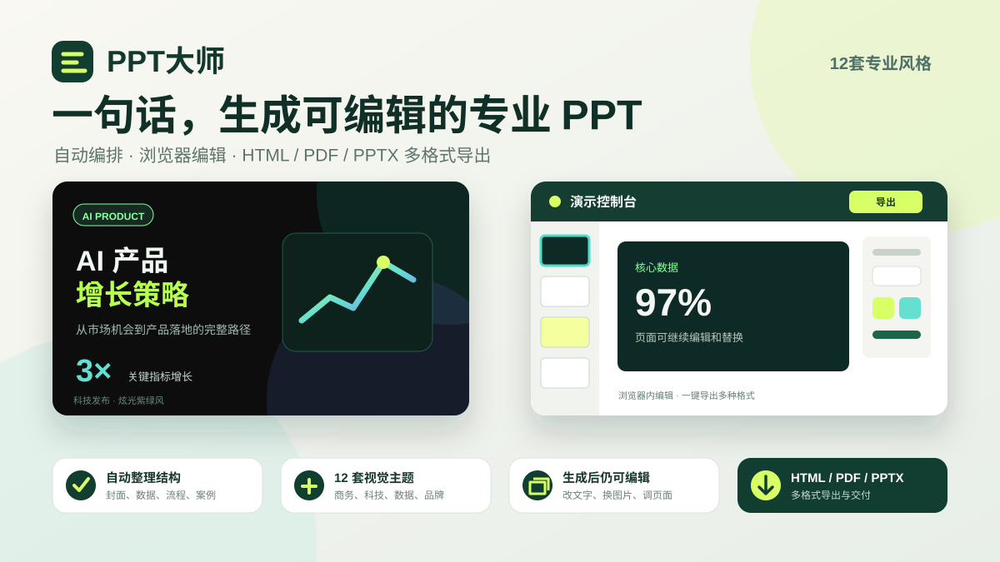

<!-- ppt-master-generated-readme -->
# PPT大师



一句话或一份材料，生成结构完整、视觉统一、可以继续编辑和导出的专业 PPT。

当前版本: `1.3.0`

## 30 秒看懂 PPT大师

- **12 套专业风格**：商务汇报、科技发布、数据研究、品牌提案、融资路演等场景均可覆盖
- **自动组织内容**：从目标和材料中整理大纲，组合封面、数据、流程、案例和结尾页
- **浏览器内可编辑**：继续修改文字、替换图片或视频、调整页面属性和切换动画
- **多格式交付**：支持 HTML、PDF 和可编辑 PPTX

可以直接这样说：

- “把这份材料做成 10 页老板汇报，重点突出结论。”
- “做一份 AI 产品融资路演 PPT，用深色科技风。”
- “把年度总结整理成 12 页可编辑 PPTX，数据感强一些。”

## 免费开始

[免费注册领取体验点数](https://admin.llyouliang.top/recharge/)

首次调用且尚未连接账号时会打开本机“安装完成”欢迎页；已经看过欢迎页并连接成功的用户不会反复进入注册流程。注册后可在同一页创建使用密钥、粘贴并点击“保存并测试”，无需手动配置环境变量。API Key 相当于你的使用凭证，只保存在自己电脑上，不要粘贴到公开对话中。

## 点数与隐私

- 使用密钥优先读取旧版 `WRITER_API_KEY`，否则读取欢迎页保存的本机私有配置；与墨序文章 Skill 共用同一账户、点数余额和充值入口。其他 Skill 是否自动读取这份本机配置取决于其版本。
- 费用按后台设置的“每页点数 × 确认页数”计算。每次生成前先报价，用户确认后预留点数。
- PPT 在 WorkBuddy 中生成。生成和校验完成后再结算；后台只保存页数、文件格式、费用和 SHA-256 摘要，不上传 PPT 文案或成品文件。
- 未配置密钥、点数不足或 PPT 计费开关未开放时，Skill 会显示密钥页或充值页入口。不要在公开对话中粘贴 API Key。

## 它适合做什么

- 行业研究、融资复盘、竞品分析和趋势报告
- 项目汇报、方案展示、路演材料和内部培训
- 需要快速形成结构完整、视觉统一、可继续编辑的演示文稿

## 你会得到什么

- 一份本地 HTML PPT,打开后即可横向翻页
- 预览页里可以继续改文字、换图片/视频、调整页面属性
- 你提供的图片/视频会写入本次 deck,成品不依赖原始素材路径
- 可以导出 HTML、PDF 或 PPTX
- 免费能力展示保留“PPT大师”品牌；已确认报价并成功预留点数的正式 HTML、PDF、PPTX 默认不显示固定右下角水印
- 所有输出都保存在本机,适合继续归档、修改或交付

## 第一次怎么使用

安装后，在 WorkBuddy、Codex 或支持 Skill 的 Agent 中调用 `ppt-master`。如果只说“PPT大师”，它会打开本机安装完成页，展示功能缩略图、示例需求，并引导注册、创建密钥和测试连接；也可以直接描述想做的 PPT：

- 主题和目标
- 面向谁汇报
- 希望几页
- 想突出的结论或内容
- 偏好的视觉风格

如果没有指定风格，PPT大师会先推荐 1 套最适合的风格，并给出最多 2 套备选；回复“用推荐的”即可继续。

## 当前风格

当前包含 12 套已接入风格:

- `theme01` 轻拟态风 (84 页): 适配场景: 产品介绍、企业汇报、方案说明、轻量级发布; 适配人群: 创业团队、产品经理、销售顾问、企业内部汇报者
- `theme02` 炫光紫绿风 (74 页): 适配场景: 科技发布会、AI/自动驾驶/机器人主题、增长故事、创新项目展示; 适配人群: 科技公司创始人、技术负责人、品牌市场团队、投资路演团队
- `theme03` 深浅代码风 (77 页): 适配场景: 技术方案、开发者大会、系统架构、AI 工程实践; 适配人群: 工程师、技术管理者、架构师、开发者社区
- `theme04` 玻璃糖果风 (74 页): 适配场景: 年轻化品牌、消费产品、创意提案、社媒感内容; 适配人群: 品牌团队、设计师、内容创作者、消费品团队
- `theme05` 色谱图表风 (94 页): 适配场景: 数据报告、市场分析、KPI 复盘、行业研究; 适配人群: 数据分析师、咨询顾问、研究员、业务负责人
- `theme06` 深色图谱风 (83 页): 适配场景: 高密度数据展示、战略分析、科技/金融/产业报告; 适配人群: 战略团队、投资人、产业研究团队、高管汇报者
- `theme07` 冷白调研风 (71 页): 适配场景: 调研报告、白皮书、竞品分析、学术研究表达; 适配人群: 研究机构、咨询团队、品牌团队、B2B 团队
- `theme08` 黑金实验风 (84 页): 适配场景: 高端发布、品牌提案、实验性概念、奢华科技叙事; 适配人群: 高端品牌、创意总监、科技品牌、发布会策划团队
- `theme09` 深蓝杂志风 (111 页): 适配场景: 品牌故事、人物访谈、企业形象册、深度专题; 适配人群: 公关团队、媒体编辑、创始人、企业品牌部
- `theme10` 金色指数风 (95 页): 适配场景: 金融数据、投资报告、商业指数、年度榜单; 适配人群: 投资机构、金融分析师、咨询公司、商业媒体
- `theme11` 高能增长风 (87 页): 适配场景: 增长复盘、商业计划、融资路演、市场扩张方案; 适配人群: 创业者、增长团队、销售团队、VC/PE 路演团队
- `theme12` 声波霓虹风 (86 页): 适配场景: 音乐娱乐、潮流活动、直播内容、年轻化发布; 适配人群: 娱乐品牌、活动策划、内容团队、潮流消费品牌

每套风格都有独立的页面结构和视觉语言,适合不同类型的报告和展示场景。

## 安装说明

把整个 `ppt-master` 目录放到本机 Skill 目录中,然后重新打开会话即可使用。

本机需要能运行 Python 3.10+、Node.js 18+ 和 npm。PPT大师会先确认需求并给出免费报价；用户确认后显示 3 段准备进度，准备成功才预留点数，后续调用无需重复等待。跨平台准备和生成入口兼容 Windows、macOS 与 Linux。

Codex 默认安装位置:

```text
~/.codex/skills/ppt-master
```

仓库中不包含 `node_modules`。为同时满足 SkillHub 的纯文本、文件数量和总体积限制,
内置生成器已编码为若干 `project-runtime.partNN.txt`;首次制作时会自动恢复 `project/`,
再根据 `project/package-lock.json` 安装依赖。首次 HTML 预览不再等待额外浏览器运行包；PDF/PPTX 导出优先使用系统浏览器，没有可用浏览器时会在第一次导出时按需安装专用组件。正式 PDF/PPTX 导出会同时生成同名校验清单，用于结算前核对真实格式、页数、水印状态和文件摘要。

轻量版不再捆绑大量网页字体文件,会优先使用电脑自带的中文与英文字体。

## 更新提醒

当前版本不会主动联网下载或覆盖本地文件。后续新版本以发布页面显示为准。
