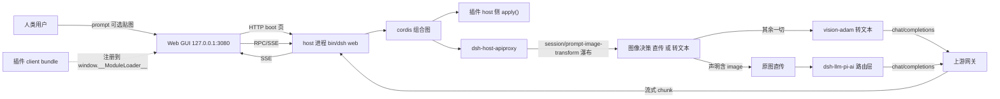
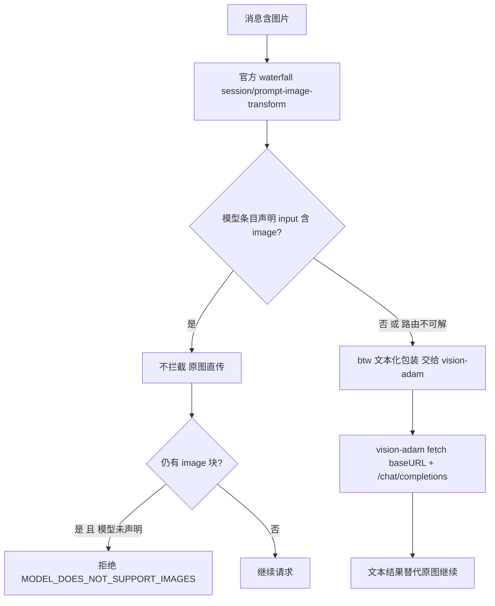
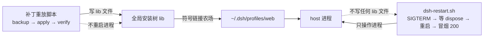

# 01 · 架构总览（dsh-hub）

> **Tier 3 · 参考** · [指南地图](../../README.md) · [程序笔记本](../program-notebook.md)

> **数据时点**：2026-09-20 ｜ **部署基线**：`@deepseek-ai/dsh` **0.1.1-rc.2**（profile `web`）
> **证据规则**：每条结构断言给出 `path:line`；无法验证的标 **未知**。
> **本页不包含**：补丁重放的逐步操作（→ `04-ops-deploy.md`）、插件契约与热载矩阵（→ `02-plugin-system.md`）、
> 模型路由与网关细节（→ `03-model-routing-gateway.md`）。本页只回答「这个仓库由什么组成、它们怎么连」。

---

## 1. 归属表（谁拥有什么）

| 职责 | 归属 | 判据 |
| --- | --- | --- |
| DSH 本体（宿主、官方包） | **不在本仓库**；全局安装在 `~/.npm-global/lib/node_modules/@deepseek-ai/dsh` | 本仓库无根 `package.json`（`ls package.json` 无此项） |
| 自装插件源码 | 本仓库 `dsh-btw/` `dsh-usage/` `dsh-taste/` `dsh-wallpaper-local/` `session-board/` `examples/` | 各有自己的 `package.json` |
| 官方包补丁 + 重放脚本 | `.workspace/workstreams/deploy/` | `deploy-*/patches/*.patch` + `*.sh` |
| 运行时组合图 | `~/.dsh/profiles/web/cordis.patch.yml`（**不在本仓库**） | 该文件是唯一 `insert` 挂载入口 |
| 运行时设置 / 凭据 | `~/.dsh/settings.yaml` / `~/.dsh/.credentials.yaml`（**不在本仓库**） | 见 `03-model-routing-gateway.md` §A |
| 证据（审计/执行/复核/调研/事故/验收） | `.workspace/reports/` | 本页索引 |
| 探针脚本与一次性产物 | `.workspace/probes/` | `*.sh` / `*.json` / `*.png` |
| 备份 | `.workspace/backups/`（`.gitignore` 排除） | `.gitignore` |

---

## 2. 仓库布局（跟踪内容）

```
/home/CNS2026495165/dsh/                       ← 本仓库根 = DSH 的工作区
├── README.md  FEATURE-MAP.md  DOC-STYLE.md     ← Tier 0/2：入口 / 能力地图 / 风格约定
├── docs/
│   ├── program-notebook.md                     ← Tier 0：本仓库中枢（索引 + 摘要 + 缺陷）
│   ├── architecture/01..04-*.md                ← Tier 3：本目录四篇专题
│   └── runbooks/                               ← Tier 1：switch-web2 / verify 两份操作手册
├── dsh-btw/          dsh-usage/                 ← 自装插件（host + client 双面）
├── dsh-taste/        dsh-wallpaper-local/       ← 自装插件（含官方命名空间的那个）
├── session-board/dsh-session-board/             ← 自装插件（host-only，包在子目录）
├── examples/minimal-plugin/                     ← 脚手架（4 文件）
├── pi-taste-analysis/                           ← 调研档 + vendored 上游 TS 源码（非插件）
└── .workspace/                                  ← 证据 / 部署 / 探针 / 备份
    ├── reports/{audits,execs,plans,reference,research,runbooks,diagnostics,incidents,handoff,push-logs,docs-reorg}/
    ├── workstreams/deploy/deploy-*/             ← 11 个部署批次（含 patches/ 与重放脚本）
    ├── workstreams/{sources,baseline-011,plugin-restore,side-deploy,upstream-015-diff,tmp-tgz-audit}/
    ├── workstreams/research/research*/           ← 插件生态调研（含 vendored 仓库克隆）
    ├── probes/{acceptance,mmt,twin,captures,settings-snapshots,workflow-drivers,previews,legacy}/
    └── backups/                                  ← 已 gitignore
```

> 结构性事实：本仓库**没有**根级 `src/`、`tests/`、`.github/workflows/`，也没有根 `AGENTS.md` /
> `CLAUDE.md` / `HOW2USE.md`。多插件平铺 + `.workspace/workstreams/deploy/deploy-*/` 脚本是其真实形态——这一形态会影响
> 一切「按标准布局猜路径」的检查器，勿把它当成 Node 单包工程。

---

## 3. 模块清单（职责 / 边界 / 关键依赖）

### 3.1 自装插件

| 目录 | 包名 · 版本 | 形态 | 职责与边界 | 关键依赖（`peerDependencies`） |
| --- | --- | --- | --- | --- |
| `dsh-btw/` | `@local/dsh-btw` · `0.4.0-btw.1` | host + client | 侧边对话：贴图管线（vision-adam 转文本 或 声明支持图片时原图直传）、子代理树/项目总览跳转、面板对齐 | `@deepseek-ai/schemastery`、`zod` |
| `dsh-usage/` | `@local/dsh-usage` · `0.1.0` | host + client | API 用量统计：面积/柱状/热力图（自绘 SVG）+ 自绘 tooltip；host 侧为**多文件手写模块**（非打包产物） | 无 `dependencies`；`dsh.client` 只 inject `@deepseek-ai/dsh-client-connection` |
| `dsh-taste/` | `@deepseek-ai/dsh-taste` · `0.1.0` | host + client | 偏好记忆（本地 fork/port 上游 pi-taste 思路）；**占官方命名空间、不带 `dsh.bundle.patch`** | 无 `dependencies`；client inject 3 项（runtime / locale / client-connection） |
| `dsh-wallpaper-local/` | `@local/dsh-wallpaper` · `0.5.0` | host + client | 静态壁纸 fork（移除上游钉 9191 端口的 webserver 条目）；`dsh.client.immediately = true`（首屏即执行） | 无 `dependencies`；client inject 4 项（含 ui-theme / ui-settings） |
| `session-board/dsh-session-board/` | `@deepseek-ai/dsh-session-board` · `0.1.0` | **host-only** | 会话状态看板（board/capture/grouping/inject/storage/tool 多模块）；**无 `lib/client.js`、无 `exports`、无 `cordis.patch.yml`** | `@deepseek-ai/schemastery` |
| `examples/minimal-plugin/` | `@local/dsh-minimal-plugin` · `0.1.0` | host（+可选 client） | 最小脚手架：`name/inject/apply/Config` + 1 个示例工具 + 可选 settings 段；零运行时依赖 | peer：`cordis` / `dsh-settings` / `dsh-tools` / `schemastery` |

**目录名 ≠ 包名**（两处）：`dsh-wallpaper-local/` → `@local/dsh-wallpaper`；
`session-board/` 根目录**没有 `package.json`**，真正的包在其子目录 `session-board/dsh-session-board/`。

**不是插件**：`pi-taste-analysis/` 无 `package.json`，内容是分析档 + `vendor/pi-taste/`
（上游 Pi coding agent 的 TS 源码副本，`pi-taste@0.5.6`，入口 `./index.ts`）——作为移植参考存在，**不可挂载**。

### 3.2 运行时组合（谁把插件装进进程）

- 组合图由 **cordis loader** 持有；本仓库的插件通过 profile 层 patch 的 `insert` 条目进入组合图。
- 本仓库根级只有 **3 个** `cordis.patch.yml`：`dsh-btw/`、`dsh-usage/`、`dsh-wallpaper-local/`
  ——恰好等于声明了 `dsh.bundle.patch` 的包；`dsh-taste/`、`session-board/…`、`examples/minimal-plugin/` 都不带。
- 运行时装单位是 `~/.dsh/profiles/node_modules/@local/` 下的**真实目录拷贝**（非符号链接）；
  `~/.dsh/profiles/node_modules` 整体是符号链接农场，依赖从全局安装树解析。
- 完整契约、`applyEntryPatches` 语义与 client bundle 注册见 `02-plugin-system.md`。

### 3.3 部署/补丁批次

`.workspace/workstreams/deploy/` 下 11 个批次，按补丁对象与用途分组：

| 批次 | 对象 |
| --- | --- |
| `deploy-lag/` | 卡顿修复 5 补丁 + `dsh-restart.sh` + `patch-official-015.sh`（0.1.5 借码重放） |
| `deploy-015/` | 0.1.5 借码批次的补丁与完整副本（`patches/*.patch`） |
| `deploy-slots/` | 官方 `dsh-client-ui-workspace` 槽位路径 B |
| `deploy-p0/` | `dsh-subagent` materialize 冷恢复 |
| `deploy-pptmaster/` `deploy-ssh-gui/` `deploy-subagent-model/` `deploy-vision-prompt/` `deploy-vision-settings/` `deploy-workerspace/` `deploy/` | 各插件的部署包与配置片段 |

**关键相对路径约束**：`deploy-lag/*.sh` 用 `SCRIPT_DIR`（`${BASH_SOURCE[0]}` 所在目录）解析自身资源，
并以 `$SCRIPT_DIR/../deploy-p0/…`、`$SCRIPT_DIR/../deploy/patches/…` 引用**同级批次**——因此这 11 个
目录必须**整体移动、保持同级**，否则相对引用断链。详见 `04-ops-deploy.md` §脚本清单。

---

## 4. 数据流展开

### 4.1 主链路（人类 → 宿主 → 模型）



### 4.2 图像能力的 fail-closed 判定链

这是本仓库最容易误判的一条链路：**「模型能力未知」永远落回保守路径**。



- 判定只认**声明**，不做运行时探测：唯一返回「支持」的条件是 `inputModalities` 含 `'image'`；
  路由不可解、注册表缺失、查询抛错、模态缺失/为空一律返回「不支持」。
- 本部署净效果：adam **50 个条目中有 3 个**声明了 `image`（`deepseek-v4-pro`、`deepseek-v4.1-flash`、`deepseek-v4-flash-vision-exp`，见 `settings.yaml:81-85` / `:173-182`）⇒ 图片是否走 vision-adam 转文本**取决于当前会话模型**：主会话默认 `deepseek-v4-pro`（已声明）可原图直传；未声明图片能力的模型（如 `deepseek-v4-flash`）仍走 vision-adam。
- 行号级证据见 `03-model-routing-gateway.md` §图像能力检测。

### 4.3 补丁与进程的正交分工



判据：**改代码不重启不生效，重启不改代码**——两者正交，标准流水线是「先跑补丁脚本，再跑
`dsh-restart`」。`dsh-restart.sh` 头部逐字声明它「不写任何 lib 文件」。

---

## 5. 生命周期、所有权与边界条件

| 对象 | 生命周期 | 所有权 | 边界条件 / 陷阱 |
| --- | --- | --- | --- |
| host 进程 | 启动 → 服务 → SIGTERM 有界等待 dispose（默认 15s）→ 退出 | 用户/`dsh-restart.sh` | 超时**默认中止不杀进程**（需显式 `--force`）；只对 `/proc/<pid>/cmdline` 匹配 `bin/dsh … web` 的进程发信号；多实例时拒绝猜测 |
| 会话 | 持久化为 zstd JSONL + checkpoint；重启后自动 resume | host | **进行中回合的内存态会丢失**（已知取舍，需重发） |
| 组合图 | boot 时装配；profile patch 条目可热改 | cordis loader | 条目级热载约 1s；**改宿主 `lib/*.js` 属冷面**（ESM 模块缓存不重读） |
| client bundle | 页面加载时经 `__ModuleLoader__` 注册 | 浏览器 | 替换 bundle + 刷新即生效；改 `dsh.client` 声明 = 冷（pkgMeta 缓存） |
| settings 值 | 进程内每次读取取值 | `dsh-settings` 服务 | 值级热载；**schema/代码类改动需随插件部署重启一次** |
| 备份目录 | 每次补丁运行创建时间戳目录 | 补丁脚本 | 备份 ≠ live 态（可能缺后续单元），回滚会连带退掉后续改动 |

---

## 6. 未验证项

1. `bareModuleBaseUrl` 的实参来源未定位（`dsh-web-app` 侧 grep 无命中）。
2. cordis 内核 `EntryGroup.update` / `Entry.update` / `_patchContext` 的逐行实现未读（仅以实测与官方包注释为准）。
3. 浏览器收到 client bundle `rebuilt` SSE 帧后是否自动重载未确认。
4. `@deepseek-ai/dsh-session-board` 的运行时装单位未确证（未出现在 `~/.dsh/profiles/node_modules/@local/` 列表中）。
5. `dsh-btw/lib/index.js`（约 65 KB）与 `dsh-taste/lib/index.js`（约 27 KB）内部结构未逐行通读——本文对它们的描述基于 `package.json` 声明与体积，属**声明级**而非**实现级**结论。
