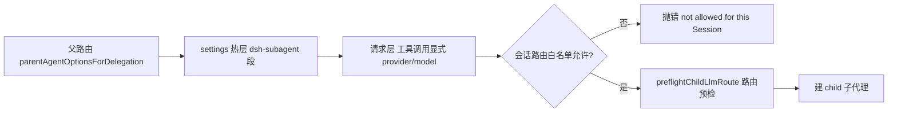
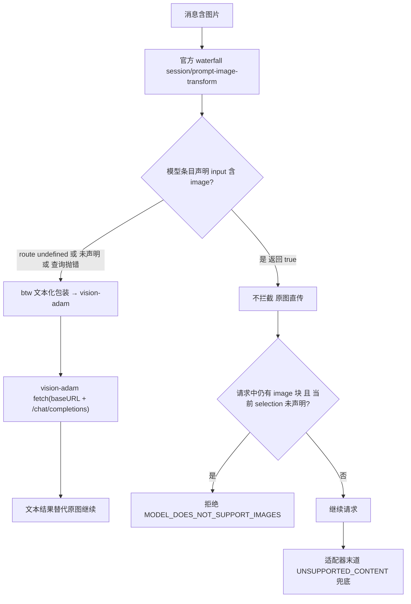

# 03 · 模型路由与网关（provider · 路由合并层 · 图像能力检测）

> **Tier 3 · 参考** · [指南地图](../../README.md) · [程序笔记本](../program-notebook.md) · [架构总览](01-architecture-overview.md)

> **数据时点**：2026-09-20 ｜ **部署基线**：`@deepseek-ai/dsh` **0.1.1-rc.2**（profile `web`）
> **证据规则**：每条断言给 `path:line`；**不打印任何密钥值**，只写 `apiKeyEnv` 引用名。
> **本页不包含**：插件契约与热载矩阵（→ `02-plugin-system.md`）、补丁重放操作（→ `04-ops-deploy.md`）。

---

## 1. 归属表

| 职责 | 归属 | 判据 |
| --- | --- | --- |
| provider / model 清单与默认值 | `~/.dsh/settings.yaml` 的 `llm-pi-ai` 段 | §2 |
| 配置 schema、默认 `contextWindow`、模态默认值 | 官方包 `@deepseek-ai/dsh-llm-pi-ai` | §3 |
| 子代理模型路由的合并层 | 官方包 `@deepseek-ai/dsh-tool-subagent` | §4 |
| 密钥**值** | `~/.dsh/.credentials.yaml`（**本仓库与 settings 都不存值**） | §2.3 |
| 图像能力判定（直传 vs 转文本） | `dsh-btw` 的 `vision.ts` / `prompt-transform.ts` + 官方 apiproxy 闸门 | §5 |
| 识图转文本的实现 | 自装插件 `@deepseek-ai/dsh-vision-adam`（**不在官方 dsh 包内**） | §6 |

---

## 2. 生效设置：Provider 清单

**运行中的 host 只读 `~/.dsh/settings.yaml` 一处**（`~/.dsh` 下无第二份，profile 目录内也没有）。
路径规则：显式 `path` 优先，否则 `<harness home>/settings.yaml`（harness home 名固定为 `.dsh`，
优先级 `configured path > $DSH_HOME > ~/.dsh`）。运行进程环境里**没有** `DSH_HOME`，也**没有任何
`*_API_KEY`**——密钥由 credentials 服务解析，不是环境变量。

设置命名空间：`llm-pi-ai`。

| provider | baseURL | api | apiKeyEnv | 模型条目数 |
| --- | --- | --- | --- | --- |
| `opencode-go` | **未设置**（走内置 catalog 默认） | 未设置 | `OPENCODE_GO_API_KEY` | 16 |
| `adam` | `https://llmapi.roboscience.xyz/v1` | `openai-completions` | `ADAM_API_KEY` | 50 |
| `llm-deepseek` | —（段为空对象） | — | — | — |

### 2.1 模型条目的字段分布（易踩坑）

- `opencode-go`：条目**全部**显式给 `contextWindow` 与 `maxTokens`。
- `adam`：条目**基本只给 `contextWindow`**，不给 `maxTokens` ⇒ 回退路由默认 `32768`。
- 声明 `input` 的只有 **2 个 adam 条目**：`deepseek-v4.1-flash`、`deepseek-v4-flash-vision-exp`（均含 `image`）。
- 名字里带 `image` 的**图像生成类**模型（`gemini-3-pro-image-preview*`、`veo3.1-*`）**没有**声明 `input`——它们是输出型模型，不要误当成"支持图像输入"。

### 2.2 默认上下文容量：262144 的来历

| 常量 | 值 | 语义 |
| --- | --- | --- |
| `DEFAULT_CONTEXT_WINDOW` | **262144** | 模型既未被配置、也未被 catalog 定尺寸时假定的上下文容量 |
| `DEFAULT_MAX_TOKENS` | `32768` | 默认输出上限 |
| `DEFAULT_INPUT` | `["text"]` | **未声明即文本** |

三级回退顺序（逐条 `??`）：`entry.contextWindow ?? base?.contextWindow ?? request.defaultContextWindow`；
`maxTokens` 同构。schema 把两个常量作为**路由级**默认值（`defaultContextWindow` / `defaultMaxTokens`），
实例化路由时再用字面量兜底一次（双保险）。

> 历史坑：adam 曾有 45/50 条目未声明 `contextWindow` → 全部回落到 262144 → 正常轮次末步被误判
> `CONTEXT_WINDOW_EXCEEDED`。修复按「证据优先保守档」补齐 40 条，并把 `deepseek-v4.1-flash`
> 的真实窗口夹到 `(998,887, 1,055,800]`（与 2^20 吻合）。**该网关超窗时返回的是 `500 get_channel_failed`，
> 不是长度错误文案**——所以客户端的窗口声明必须准。证据：
> `.workspace/reports/execs/acceptance/acceptance-exec.md` §3.6。

### 2.3 凭据解析

- `apiKeyEnv` 只是**引用名**；值在 `~/.dsh/.credentials.yaml`（永不入库）。
- 运行时解析顺序（以 vision-adam 为例）：credentials 服务 → 启动环境变量 → 配置里的字面量 `apiKey`；
  三者皆无则**抛错**，不静默用空 key。

---

## 3. 配置 schema 要点

- `providers` 是 **dict（按 provider 路由 id 键控）**，不再是数组；传数组会直接抛错
  （`llm-pi-ai: providers is now a dict keyed by provider route, not an array of profiles`）。
- 模型条目字段：`id` / `name` / `contextWindow` / `maxTokens` / `input` / `reasoningEfforts` / `compat`。
- 模态集合只有 `text` / `image` 两种；`declaredInput()` 把**空数组与缺省视为等价**（都表示"未声明"），
  因此 `input: []` 不会打开直传。

---

## 4. 子代理模型路由的合并层

### 4.1 派发顺序（`dsh-tool-subagent` 的 `execute`）



### 4.2 「settings 压过 preset」是**字段级**，不是整对象替换

```
configured = preset 的 agentOptions
if settings 段存在且非空:
    return { ...(configured ?? {}),                    // 先铺 preset
             ...(provider === undefined ? {} : { provider }),   // 再逐字段覆盖
             ...(model    === undefined ? {} : { model }) }
```

- 读 settings **失败**（服务缺失/取值抛错）→ **原样回退 preset**，不抛错。
- 读取点**每次派发都重读** ⇒ 改 settings.yaml 下一次派发即生效（热②）。
- **请求层**语义：只在显式传 `provider` 时改路由，且 `provider` 与 `model` **必须成对**，否则抛错。
- 能力闸门：provider 不支持 child `agentOptions` 时，配置或选择都直接抛错（fail-closed）。

### 4.3 ⚠️ 本部署的实际生效路由（与旧文档冲突，以本节为准）

本部署 `settings.yaml` 的 `dsh-subagent` 段**只设了 `model`，没有设 `provider`**：

```yaml
dsh-subagent:
  model: deepseek-v4-pro
```

按 §4.2 的字段级合并 ⇒ preset 的 `provider: adam` 被**保留**，只有 `model` 被替换。

| 载体 | 声明值 | 证据 |
| --- | --- | --- |
| preset `subagent` / `subagent_fork` | `adam` / `deepseek-v4.1-flash` | `~/.dsh/.agent-presets/standard-glm/agent.cordis.yml`（subagent 段与 fork 段） |
| settings 覆盖 | **仅 `model: deepseek-v4-pro`** | `~/.dsh/settings.yaml` 的 `dsh-subagent:` 段 |
| **生效路由（推论）** | **`adam/deepseek-v4-pro`** | §4.2 合并代码 + 上两行 settings 值 |

> `~/.dsh/AGENTS.md` 与 preset 注释里「两阶段统一路由 `adam/deepseek-v4.1-flash`」的说法
> **已被本部署 settings 段覆盖**，不得照抄进文档。设置页把「默认 = `adam/deepseek-v4.1-flash`」
> 写成展示文案，并明示**清空字段**才回到该默认。
> **诚实标注**：此结论是「代码行为 + settings 当前值」的推论，**未做运行时活体探针**（列入 §8）。

### 4.4 三条路由常量（本仓库实际存在的）

| 载体 | provider / model | 说明 |
| --- | --- | --- |
| `subagent` | `adam` / `deepseek-v4.1-flash` | preset 固定（见 §4.3：会被 settings 覆盖） |
| `subagent_fork` | `adam` / `deepseek-v4.1-flash` | 同上 |
| `workflow`（`workflow-worker-thread`） | **无 `agentOptions`**（仅 `provider: spawn`） | **模型继承父代理——「workflow 默认模型」在本仓库不存在**，历史文档若写具体模型即臆造 |
| `btw` 侧聊 | 默认值在插件源码里，**不在 preset**（preset 未插入 btw） | `dsh-btw/src/host/vision.ts` 的 `VISION_DEFAULTS` 给出识图兜底：model `deepseek-v4.1-flash` / baseURL opencode 网关 / `OPENCODE_GO_API_KEY` / maxTokens 2000 |

默认 preset 通过 patch 层指向 `standard-glm`，与 settings 的 `agent-presets.default` 一致。

---

## 5. 图像能力检测（fail-closed 链）

判定链：**声明 `input` 含 `image` ⇒ 原图直传；否则 → vision-adam 转文本**；一切不确定都落到保守路径。



三点必须写对：

1. **判定基准 = 声明，不是运行时探测**。唯一返回 `true` 的条件是 `inputModalities` 含 `'image'`；
   路由不可解、注册表缺失、查询抛错、模态缺失/为空——一律 `false`。
2. **官方 host 闸门未被改动**：`session/prompt-image-transform` 瀑布返回 `undefined` = 不拦截原图继续；
   之后若仍有 image 块而模型未声明 → 拒绝文本模型（fail-closed）。
3. **本部署净效果**：adam 50 个条目中有 3 个声明了 `image` ⇒ 图片是否直传取决于当前模型，**部分图片流量
   仍走 vision-adam 转文本**。把图直发给未声明的模型会被宿主闸门拒绝（预期行为，不是 bug）。

---

## 6. vision-adam 插件（网关、配置与加固）

| 项 | 插件默认值 | 本部署覆盖（settings `vision-adam` 段） |
| --- | --- | --- |
| baseURL | `https://opencode.ai/zen/go/v1` | `https://llmapi.roboscience.xyz/v1`（adam 网关） |
| apiKeyEnv | `OPENCODE_GO_API_KEY` | `ADAM_API_KEY` |
| model | `deepseek-v4.1-flash` | `deepseek-v4.1-flash` |
| maxTokens | `2000` | `393216` |

- 解析是**逐字段 `??` 回退**：settings 段缺哪个键就用哪个默认常量。
- **不在官方 dsh 包内**：它是本部署自装的第三方插件，靠 profile patch 的 `insert` 行挂载。
- 源码副本 `.workspace/workstreams/sources/dsh-vision-adam-src/` 与部署副本**字节一致**（md5 相同），可任引一处。
- **尾斜杠归一化（2026-09-17 加固）**：

```js
// 尾斜杠归一化（2026-09-17 加固）：`${baseURL}/chat/completions` 在 baseURL 带尾斜杠时
const baseURL = options.baseURL.replace(/\/+$/, "");
const response = await fetch(`${baseURL}/chat/completions`, { … });
```

- 三头鉴权：`authorization: Bearer <key>` + `x-api-key` + `x-opencode-session`（随机 UUID），
  后两者可经 `xApiKey: false` / `sessionHeader: false` 关闭。
- 媒体承载：视频走智谱风格 `video_url`，图片走 `image_url`（base64 data URL）。
- 配置 schema 含 `apiKey`(secret) / `apiKeyEnv`(credential-ref) / `baseURL` / `model` / `maxTokens` /
  `maxBytes` / `maxVideoBytes` / `xApiKey` / `sessionHeader`；设置页 GUI 只字段级读写其中 4 个，
  **apiKey / maxBytes 等键永不触碰**。

> 历史故障：曾出现 `Invalid URL (POST /v1//chat/completions)`。**该文案实为网关 404 响应体**，
> 真正拼出 `//` 的是本插件手写的 `` fetch(`${baseURL}/chat/completions`) ``（provider 层因为
> OpenAI SDK 会切前导斜杠而没症状）。现已归一化，不再依赖"配置恰好无尾斜杠"。

---

## 7. preset 与热载边界

- 默认 preset = `standard-glm`（用户自建，位于 `~/.dsh/.agent-presets/standard-glm/`）。
- **preset 不是"永不热"**：`mount()` 只在**会话创建**时调用，`ensureStanding` 内有
  `compositionStamp`(mtimeMs + size) 重挂载检查 ⇒ **改动后新建的会话本来就能拿到新组合**；
  保持原代际的是"改动前已存在的会话及其子代理"（子代理经 `bindScopeParent` 复用父 standing mount）。
- 要热换子代理模型请改 **settings 的 `dsh-subagent` 段**（每次派发重读）。

---

## 8. 未验证项

1. **子代理实际路由未做活体探针**：§4.3 的 `adam/deepseek-v4-pro` 是代码行为 + settings 值的推论。
2. `opencode-go` 的内置 catalog 实际 `baseURL` / `api` 取值未打开确认（settings 里只有 `apiKeyEnv`）。
3. `workflow` 是否存在其它设置层覆盖（除 preset 外）未确认。
4. **btw 侧聊默认模型 id 的字面量**未逐行确认：`routeOf(defaults?.currentSelection?.())` 是收口点，
   但历史报告写的默认 id 与 `VISION_DEFAULTS` 的识图默认 `deepseek-v4.1-flash` **不同源**，需另行核实。
5. 受压探测给出的窗口区间 `(998,887, 1,055,800]` 是**夹逼**结果，不是精确值。
