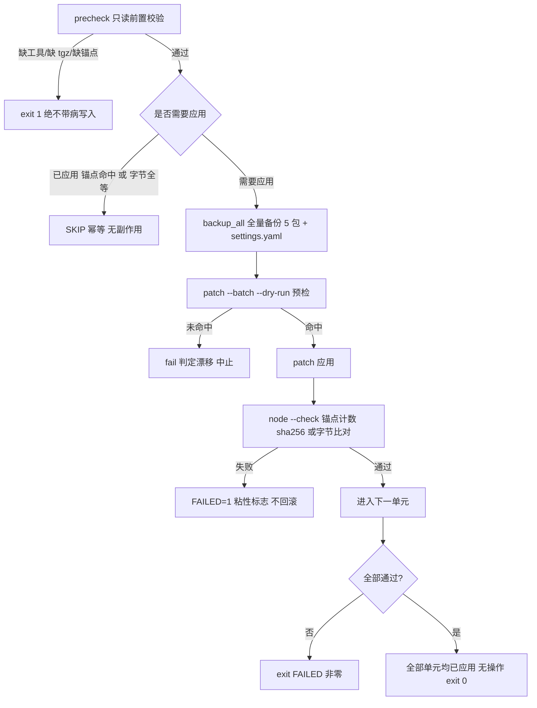

# 04 · 运维与部署（补丁重放 · 重启 · 验收 · 测试 · 备份）

> **Tier 3 · 参考** · [指南地图](../../README.md) · [程序笔记本](../program-notebook.md) · [架构总览](01-architecture-overview.md)

> **数据时点**：2026-09-20 ｜ **部署基线**：`@deepseek-ai/dsh` **0.1.1-rc.2**（profile `web`）
> **证据规则**：每条断言给 `path:line`；**本页所有 fail-closed 结论来自源码逐行阅读，未在本机实跑脚本**
> ——「脚本在当前盘面上实跑是否 PASS」一律标注 **Unknown**。
> **本页不包含**：插件契约（→ `02-plugin-system.md`）、模型路由（→ `03-model-routing-gateway.md`）、
> 逐场景操作手册（→ `../runbooks/` 与 `.workspace/reports/runbooks/`）。

---

## 1. 归属表（三层分工，可复判）

| 层 | 归属工具 | 管什么 | 不管什么 |
| --- | --- | --- | --- |
| **代码层** | 重放脚本 `replay-lag-fix.sh` / `patch-official-015.sh` / `patch-official-slots.sh` | 把补丁写进全局树 lib 文件：备份 → 应用 → 校验 → 回滚 → 幂等 | **不重启进程** |
| **进程层** | `dsh-restart.sh` | SIGTERM 有界等待 dispose → 重启 → 冒烟 200 | **不写任何 lib 文件**（脚本头部逐字声明） |
| **配置层** | `~/.dsh/settings.yaml` 值 / `cordis.patch.yml` 条目 | 值级与条目级热载（约 1s / 下一次读取） | 不重读已加载的 ESM 模块 |

判据：**改代码不重启不生效，重启不改代码**——两者正交。标准流水线 =
「先跑补丁脚本，再跑 `dsh-restart`」。若移除某工具后某行为仍会被主动改变，说明它归另一层。

---

## 2. 脚本清单（`.workspace/workstreams/deploy/` 与 probes）

`.workspace/` 下（≤2 层，排除 node_modules 与备份目录）共 **18 个 `*.sh`**。用途全部取自脚本自身头部注释：

| 脚本 | 自述用途 |
| --- | --- |
| `deploy/deploy-lag/replay-lag-fix.sh` | subagent 多开卡顿修复 重放脚本（U-1..U-8 全量固化 + P0 btw 子代理打开修复） |
| `deploy/deploy-lag/patch-official-015.sh` | 0.1.5-rc.2 增量借码重放脚本（P0/P1/P2 全采纳） |
| `deploy/deploy-slots/patch-official-slots.sh` | 官方 `dsh-client-ui-workspace` 槽位路径 B 补丁 重放脚本 |
| `deploy/deploy-lag/dsh-restart.sh` | DSH web 优雅重启 / 宿主 lib 变更自动重启辅助（P0-c） |
| `deploy/deploy-ssh-gui/deploy.sh` | 分布式控制部署脚本（薄插件，零第三方依赖，**绝不执行 npm/pnpm install**） |
| `deploy/deploy-workerspace/deploy.sh` | dsh-workerspace 部署脚本 |
| `workstreams/side-deploy/deploy-side.sh` | 支线收尾：把 usage 与 session-board 部署包装上 web profile |
| `workstreams/plugin-restore/apply-restore.sh` | 插件恢复应用脚本（web profile 0.1.1-rc.2） |
| `probes/acceptance/probe-context-window.sh` | 受控加压探测：adam / `deepseek-v4.1-flash` 的真实上下文窗口 |
| `probes/acceptance/probe-context-window-round2.sh` | 加压探测第二轮：把边界夹到「刚好 1.0M 上下」 |
| `probes/acceptance/probe-channel-availability.sh` | 渠道可用性实测（**已写好未运行**，不消耗配额） |
| `probes/mmt/probe-adam-multimodal.sh` | 探针：adam 网关是否支持原生多模态 |
| `probes/mmt/probe-image.sh` | 探针（修正版）：图像输入实测 |
| `probes/mmt/probe-transcribe.sh` | 探针2：转录保真度对照 |
| `probes/twin/verify_twin.sh` | adam 网关「模型替身」自查脚本（串行 + 限速，不打断网关） |
| `workstreams/baseline-011/fetch.sh` | 批量下载 0.1.1-rc.2 各包 tgz（**无头部注释**） |
| `workstreams/research/research/fetch.sh` | 按参数拉取 npm registry JSON 元数据（**无头部注释**） |
| （另一处）`~/.dsh` 外的 `settings-lag/scan_sessions.sh` | 只读扫描：按是否跑过回合给每个 DSH 会话分类 |

> 目录迁移后路径变化见同目录的 `refs-to-fix.md` 与 `mapping.json`；本页写的是**迁移后**的目标路径。

---

## 3. fail-closed 契约（补丁脚本的核心承诺）

**四条硬约束（逐字来自脚本注释与代码）**

1. **备份先于任何写入**：先判定"是否需要应用"，需要才做全量备份（4 包 + `dsh-subagent` + `settings.yaml`）。
2. **应用前必做 `patch --dry-run` 预检**：未命中即判「live 文件已漂移，需重新锚定」并**中止**，不写文件。
3. **校验三件套**：`node --check`（语法）+ 锚点 grep 计数 + sha256 / 字节比对（`diff -q`）。
4. **失败不回滚**（注释逐字写明「任一失败 → FAIL + 退出非零，**不回滚**」）：`fail()` 置粘性标志 `FAILED=1`，
   脚本末尾 `exit "$FAILED"`；任一单元失败即 `|| exit 1` **立刻中止后续单元**。
   要还原请显式跑 `--rollback`（用**最新备份**还原，还原后需重启 DSH）。

**标志语义**

| 标志 | 语义 |
| --- | --- |
| `--dry-run` | 只打印将执行的步骤 + 全部前置校验，**不写任何文件**（零副作用先行） |
| `--rollback` | 用最新备份还原（前缀匹配 + 时间戳排序取尾）；还原后需重启 DSH |
| （无标志） | 默认执行：备份 → 应用 → 校验 |
| **例外**：`patch-official-slots.sh` **默认即 dry-run**，真实写入必须显式 `--apply` | |

**幂等**：每单元已应用（锚点命中 / 字节全等 / 值正确）则 SKIP 并提示；全绿时输出
「全部单元均已应用，无操作。」并 `exit 0`。

**部署脚本族同约定**：`deploy.sh` 类脚本默认 dry-run，真实安装需 `--apply`，
且「**绝不执行 npm/pnpm install**」。

---

## 4. `dsh-restart.sh`：重启与守卫

**四步序列**（预览逐条打印）：`SIGTERM → 有界等待 dispose → 等进程退出 + 端口释放 → 启动 → curl 冒烟 200`。

| 参数 | 语义 |
| --- | --- |
| （无） | 一键优雅重启当前 dsh web（同 profile、同启动方式；先 dry-run 预览 + 交互确认） |
| `--dry-run` | 走完整个流程但**零副作用**（不发信号、不启动进程） |
| `--yes` | 跳过交互确认；非交互环境未给 `--yes` 则**跳过并 `exit 2`**（防自动化误重启） |
| `--pid <pid>` | 指定目标 dsh web 进程（多实例时必填） |
| `--force` | SIGTERM 有界等待超时后用 SIGKILL；**不加则超时即中止、不杀进程** |
| `--watch [dir…]` | 监视宿主 lib `.js` 变更，防抖后自动重启（`--daemon` 后台 + `--stop` 停止） |

环境变量（可覆盖）：`DSH_RESTART_CMD`、`DSH_WEB_URL`（默认 `http://127.0.0.1:3080/`）、
`DSH_RESTART_STOP_WAIT`（默认 15s = dispose 5s + 余量）、`DSH_RESTART_BOOT_WAIT`（默认 30s）、
`DSH_RESTART_LOG`（默认 `~/.dsh/backups/dsh-restart.log`，>2MB 轮转为 `.1`）。

**五道安全闸**（回答「脚本会不会乱杀宿主进程」）

1. **PID 身份校验**：目标进程 `/proc/<pid>/cmdline` 必须匹配 `bin/dsh.* web`，只向校验通过者发信号。
2. **多实例拒绝猜测**：发现多个 dsh web 进程时报错要求 `--pid`。
3. **超时默认不杀**：`STOP_WAIT` 后仍存活 → 中止重启（未杀进程），需显式 `--force`。
4. **0 候选只启动不杀**：未发现运行中的 dsh web → 仅启动新实例。
5. **`--stop` 只杀 watcher**：校验 pidfile 进程命令行匹配 `dsh-restart*--watch*`，否则拒杀。

**watch 默认监视面**（两处最高频改动源）：`~/.dsh/profiles/node_modules/@local`（自装插件宿主 lib）
与全局补丁包树 `~/.npm-global/.../@deepseek-ai`。

**会话恢复**：会话持久化为 zstd JSONL + checkpoint，重启后浏览器自动重连；**仅「进行中回合」的
内存态丢失**（需重发）——这是已知取舍。

---

## 5. 端口 / profile / 符号链接农场

| 事实 | 值 |
| --- | --- |
| 默认端口 | **3080**（冒烟 URL 在脚本里固化为 `http://127.0.0.1:3080/`） |
| 运行 profile | `~/.dsh/profiles/web`（`package.json` 声明 `dsh.profile.bundles` 与 `"patchReload": "live"`） |
| 依赖解析 | `~/.dsh/profiles/node_modules` 是**符号链接农场**，指向全局安装树 |
| `~/.dsh/profiles/web/node_modules` | **不存在**（实测 ENOENT）——profile 自身没有私有依赖树 |
| 自装插件位 | 农场的 `@local/`（真实目录，非链接） |

> ⚠️ **仓库级禁令（逐字）**：「`~/.dsh/profiles/*` 为符号链接农场，**绝不对 `~/.dsh/profiles/web`
> 执行 npm/pnpm install**——曾致全体补丁失效」。事故成因：`npm install --prefix ~/.dsh/profiles/web …`
> 会把 198 个 `@deepseek-ai` 包装成**未打补丁的本地副本**，运行进程优先加载它们，从而绕回全部补丁。
> 完整事故档：`.workspace/reports/runbooks/master-runbook.md` §1b。

**PID 引用纪律**：历史文档里写的运行实例 PID 会过期（例：某 README 记 PID 2437836，采集时点实际为
20806）。**文档引用 PID 必须标时点，或改用判定法**——「3080 由单一进程持有、HTTP 200、旧 PID 消失」
比记住某个具体 PID 更可靠。

---

## 6. 验收与冒烟

### 6.1 冒烟判定（可作通过标准）

| 判据 | 内容 |
| --- | --- |
| 重启发生 | 旧 PID 已消失 |
| 服务唯一 | **3080 由单一进程持有** |
| 服务可用 | `curl` 返回 **HTTP 200** |
| 组合生效 | boot 页 graph 行包含预期插件 id |

### 6.2 验收矩阵（出处：总 Runbook）

| 章节 | 内容 |
| --- | --- |
| §0 已部署清单 | 「线 / 内容 / 部署位」三列部署台账（9 行） |
| §1 | 六项启动问题修复确认（「报错 / 修复（已应用）/ 验证」6 行表） |
| §1b | 重大事故记录：npm 遮蔽导致补丁集体失效 |
| §2 重启与静态核验 | 4 条命令（启动 web；curl 3080 抓 boot graph；grep settings；ls skill） |
| §3 GUI 验收矩阵 | 9 行「项 / 操作 / 期望」 |
| §4 回滚 | 4 类回滚路径（官方补丁 `patch -R`；lib 从 `backup-*` 还原；`replay-lag-fix.sh --rollback`；插件移除走 `cordis.patch.yml` 备份） |

验收记录的写法纪律（来自验收报告自身）：**所有结论由原始输出支撑；未取到的证据一律标 ⏳/⚠️，
不以「生成成功」代替验收**。

### 6.3 验收的已知红灯 / 黄灯（必须随文档一起保留）

| 标记 | 内容 | 影响 |
| --- | --- | --- |
| 🔴 R1 | 某回滚目标 glob `…index.js.bak-*.bak` 实测展开 **0 个文件** → 按字面回滚会静默失败（多了一个 `.bak` 后缀） | 已裁决「纳入文档回写」；**仓库此前无 `docs/`，修复尚未落地** |
| 🟡 | btw 现存两个备份**都不等于 live 当前态**，回滚会连带退掉后续单元（如 P0-b 热读） | 回滚指引必须保留该警告 |
| ⏳ | 真机面未实测：`dsh-ssh-gui`（SSH/真串口/serial-tcp）、`dsh-workerspace`（真机串口/烧录） | 见 `FEATURE-MAP.md` 诚实边界 |
| ⏳ | 除 `deepseek-v4.1-flash` 外，其余模型的 `contextWindow` 多为**声明值而非实测值** | 见 `03-model-routing-gateway.md` §2.2 |

---

## 7. 测试架构

| 插件 | test 命令 | 测试文件数 | 备注 |
| --- | --- | --- | --- |
| `dsh-btw` | `vitest run` | **24**（`tests/**/*.spec.{ts,tsx}`） | **唯一在 `package.json` 声明 test 脚本的插件**；`check` 串起 lint→typecheck→test→build→smoke→publint；`passWithNoTests: false`（空测试集判失败） |
| `dsh-usage` | `node test/verify.mjs` | **3** | `package.json` **无 `scripts` 段**；验收脚本覆盖面宽（zstd / db / dsh 全量对账 / cc 全量对账 / rpc 9 端点…） |
| `dsh-taste` | `node --test "test/*.test.js"` | **11** | 无 `scripts` 段；命令写在 README/REVIEW 中 |
| `session-board` | `node --test` | **2** | 内层包无 `scripts` 段；命令只在提案档中给出 |
| `dsh-wallpaper-local` | — | **0** | 无测试脚本、无测试目录 |

**量化基线（某个验收批次）**：全量 24 files / **231 passed / 2 skipped**；单文件隔离复跑 10/10 PASS。

> ⚠️ **不得写成"测试全绿"或"存在回归"**：btw 全量 vitest 首跑曾 1 failed，但隔离复跑 10/10、
> 全量复跑 3 次全绿 ⇒ 定性为**负载敏感 flake 且已加固**（`tests/host-opening.spec.ts` 的固定 tick 轮询
> 改为 wall-clock 上限 10s 的条件等待），不是本批次改动引入的回归。

**本页未运行任何测试**：上表是命令与文件盘点，`dsh-usage/test/verify-result.json` 是历史产物，
不代表当前树状态。

---

## 8. 备份布局与 gitignore

| 位置 | 数量 | 是否被 gitignore |
| --- | --- | --- |
| `.workspace/backups/*`（原 `.workspace/backup-*`，迁移后） | 14 个 | **是**（`.gitignore` 原规则 `.workspace/backup-*/`） |
| `.workspace/workstreams/deploy/deploy-lag/backup-*` | 3 个 | **是**（原规则 `.workspace/workstreams/deploy/deploy-lag/backup-*/`） |
| `.workspace/workstreams/deploy/deploy-slots/backup-*` | 1 个 | ⚠️ **否**（会进 HEAD 跟踪，与其它备份不一致） |
| `.workspace/workstreams/deploy/deploy-015/` | 447 个跟踪文件 | ⚠️ **否**（未被 ignore） |
| `~/.dsh/backups/`（仓库外） | 22 条目 | 不受本仓库 `.gitignore` 管辖 |

- 回滚基准 = 「**最新备份**」（前缀匹配 + 时间戳排序取尾）。
- 回滚动作自身也要断言：例如 slots 脚本回滚后检查锚点是否真的消失，仍命中则告警要求人工检查
  ——这是可复用的「回滚验证」范式。
- 部分脚本在回滚后明确提示「请重启 DSH 使宿主侧改动生效」。

> **迁移警告**：把 `.workspace/backup-*` 移入 `.workspace/backups/` 后，原规则
> `.workspace/backup-*/` **不再匹配**该目录的名字，但新目录 `backups/` 本身不在忽略列表里——
> **`.gitignore` 必须同步补一条规则，否则备份内容会重新进入跟踪**。本阶段按硬约束**未改
> `.gitignore`**，该项已作为待办上报（见 `.workspace/docs-reorg/reports/track-D-prep.md` R-1）。

---

## 9. 未验证项

1. **所有 fail-closed 结论来自源码逐行阅读，未实跑脚本**——「脚本在当前盘面上实跑是否 PASS」= Unknown。
2. `dsh-restart.sh --watch` 的**真机行为**未实测（防抖窗口 / 自动重启仅由源码确认）。
3. `dsh-usage` / `session-board` 测试的**实际通过状况**未核实（未运行）。
4. `probes/acceptance/probe-channel-availability.sh` **已写好但未运行**，其结论不存在。
5. R1 红灯是否已在文档层修复：**未修复**（本次才首次创建 `docs/`）。
6. `~/.dsh/profiles/web2/`（据称 0.1.5 归档树、已废弃）的存在性与状态未核实。
7. 「哪个备份对应哪个 live 态」不可保证。
8. 宿主进程（PID 20806）的启动方式来源未确证：其父进程为 `npm exec` 包装链，是否由
   `dsh-restart.sh` 启动未知。
