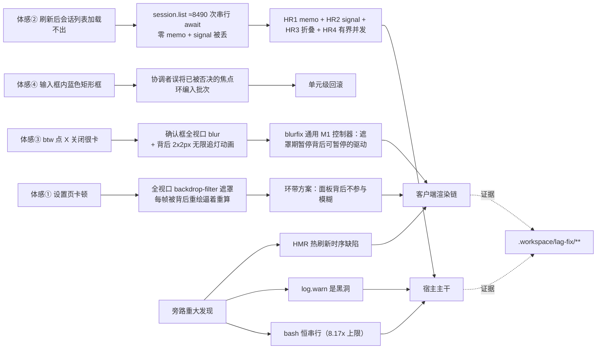

# 05 · 性能与操作体验专项（Performance & UX Program）

> **Tier 1 · 专题** · 中枢索引：[docs/program-notebook.md](../program-notebook.md)
> **数据时点**：2026-09-23（最后一轮重启后实测）。所有数字逐条给出**测量口径**与**证据路径**；
> 无法验证的一律标 **未知/INCONCLUSIVE**，不猜测补全。
> **一句话**：本页把一次「约 100 条线」的深度审计与修复闭环收敛成一篇可维护文档——**起因是用户报的四个体感问题，落点是 16 项线上改动 + 一份 13 条更正清单**。

---

## 0. 范围与证据分层

| 层 | 位置 | 内容 |
| --- | --- | --- |
| 本页（专题） | `docs/architecture/05-performance-and-ux-program.md` | 结论、前后对照、口径纪律、落地与回滚地图 |
| 中枢 | `docs/program-notebook.md` | 索引与摘要、缺陷表（§7）、未验证项（§8） |
| 审计正文 | `.workspace/lag-fix/program/w01..w29/` | 每条线的 `audit.md` + 原始 JSON（**结论的唯一出处**） |
| 执行正文 | `.workspace/lag-fix/exec-*/` | 每项的候选件、补丁脚本、`report.md`、`DEPLOY.md`（含回滚） |
| 程序索引 | `.workspace/lag-fix/program/FINDINGS-INDEX.md` | 程序级汇总：四问题前后实测、16 项落地总表、**13 条更正清单**、诚实口径 |
| 重启手册 | `.workspace/lag-fix/COLD-RESTART-RUNBOOK.md` | 批次策略与逐步命令（含"重启前先落客户端以免多刷一次"） |

**方法论**：两阶段闭环（审计 → 修订执行复核一体），阶段间用 `subagent` 并行扇出、产物落盘即记忆；
每条审计线的**末段自带同档自复核**，协调者只做裁决与落地写入。

---

## 1. 因果总图（从体感到根因再到落点）

---

## 2. 用户报告的四个问题（全部闭环，且由用户当面确认）

| # | 问题 | 修复前实测 | 修复后实测 | 落点 |
| --- | --- | --- | --- | --- |
| ① | 设置页卡顿 | 全视口 `backdrop-filter` 遮罩；交互相 LoAF **45** 条 | 先移除、后由**环带方案**恢复观感：像素差 **0.0235% >2/255**（人眼不可辨）、交互相 LoAF **1** | `dsh-client-ui-settings-general`（环带）+ `_mask` 规则 |
| ② | **刷新后会话列表加载不出** | 单发 **32.6 s / 超时 / 35.3 s**；**并发 4 路全部 60 s 超时**；`host.describe` 1.52 s | 单发 **0.28 / 0.17 / 0.11 s**；**并发 4 路 0.90–0.92 s 全 200**；`host.describe` **18 ms**；返回 **300 行 / 495 KB** | `dsh-session-persistence-jsonl` + `dsh-host-apiproxy`（HR1–HR4） |
| ③ | **btw 点 X 关闭很卡** | 确认框可见期 `>33ms` 帧占比 **74.8%**、fps **19** | **0.3%**、fps **59**；**`blur(2px)` 原样保留**；观感点阵外**整页逐字节相同** | `dsh-client-ui-theme`（blurfix 控制器） |
| ④ | 输入框内蓝色矩形框 | 焦点环被误落 | 已回滚（会话链与观感均复原） | `dsh-client-ui-conversation` 单元级回滚 |

**②的机制（本程序最重要的一条宿主侧结论）**：`session.list` 每次调用**顺序执行 ≈8 490 个 `await` 且零 memo**（20 readdir + 2 420 exists + 1 210 open/read/close + 1 210 zstd 帧解压），而宿主**单线程**在拥塞时每跳要重抢事件循环轮次 ⇒
**延迟 = 跳数 × 逐跳队列延迟**（空载 0.02 ms/跳 = 0.12–0.22 s；现场 27.6 ms/跳 = 167 s）。
**该路径的"内在工作量"只有 45–70 ms**；序列化/编解码/JSON 体积/排序合计仅 **≈1.7 ms（<1%）** ⇒ **削弱化、改体积都是错的杠杆，唯一杠杆是减少跳数**。

---

## 3. 其余线上改动（含 btw 批与 D30；原标"12 项"的计数已不再维护）

| 项 | 落点 | 实测收益 | 判据口径 |
| --- | --- | --- | --- |
| usage 九路 | `@local/dsh-usage`(client) | 切走再切回 **9 → 1 请求**；首挂载 **61.6 KB → 6.6 KB** | 请求计数 + 字节（活体探针 `rev` 自证） |
| keep-alive 三段 | general/plugins/usage/ssh-gui/ws-enh | 二次访问 RPC **0**（8/8，两器械）、DOM 节点身份存活 8/8 | 同窗计数；`mounts` 通道不可用已弃用 |
| 插件列表虚拟化 | `settings-plugin-inventory` | 面板 DOM **1396 → 186**、SVG **178 → 23**、监听器 **+178 → +27** | 计数类（确定性）；含"滚到底仍正确渲染" |
| a11y 1/2/3 | layout / workspace / btw(profile) | 弹窗 Tab×40 逃逸 **16 → 0**；Esc/遮罩**还焦触发按钮**；树行 roving `{null:11} → {0:1,-1:13}`；快捷键不再吞键 | `aria-modal` **由声明变约束**（Tab×25 逃逸 0/25） |
| 投影 rAF + 键闸门 | `dsh-client-runtime`（`/* w07-throttle v1 */`×4） | `commits÷投影帧` **1.196 → 0.246** | **主功是 rAF 合并 8.55×**；闸门本身贡献≈0（见 §5） |
| **blurfix 通用 M1 控制器** | `dsh-client-ui-theme` | 真实壳层遮罩 **71.1% → 0.3%**；负对照（介入不停）57.4% ⇒ 因果确证 | 落地后 `--no-route` 复核 `served.matchesCandidate=true` |
| **U-BOOT2 启动解绑** | 壳层 `index-ClqxG24t.js`（`29e6dacfe2c4`） | 扣住 4.1 MB 非首屏包 +1.5 s ⇒ 挂载位移 **+1481 → −56 ms**；**阴性对照仍 +1341 ms** | 双判据（解耦 + 断言未弱化） |
| **HMR 时序修复** | renderer `7468f0c6…` + hmr `8ea91bb3…` | 写客户端插件不再打断界面（对照臂 6 次崩溃/会话区 2751→1 节点；修复臂 **0 崩溃**） | 真触发 `rebuilt` 帧 + 两条阴性对照（**未吞真实错误**） |
| **btw 批** | profile 挂载位 `6c29b98b645d`（361 702 B） | 拖拽调宽高（960 软上限/窄屏隐藏/顶部锚定）+ 复活竞态 + **消掉每次开抽屉那条最长 22 237 ms 的隐形 `listTree`** | 41/41 真机 PASS + 观察者增量 0（D1/D2） |
| **btw 问答卡片修复**（2026-09-23） | `dsh-btw/lib/client.js` = `88de97e6c22fc6de9ebd61cb27e5779f`（**md5**）/ `3980d1322992`（**sha1[:12] = `?rev=`**）/ 363 814 B；**已部署**（served 字节 == 部署位 == 仓库） | **真机已验收**（headless Chromium 驱动真实 GUI 抽屉 + 真实 `btw_ask_user`；50 ms×3 s 采样）：修复前 `REVERTED firstOn=166 ms firstOff=270 ms on=2/56` ⇒ 终版 **`PERSISTED firstOn=185 ms on=55/55`**。源码/产物级另有两道锁：回归锁 C1（同 `questionId` + 新 `questions` 数组身份不清空）+ 独立交叉审计两次反向验真（注入旧 effect ⇒ C1 轮询后断言**必失败**、删 `key` ⇒ C2 **必失败**，均字节还原）。选项行 ARIA 由非法 `aria-pressed` 改为官方契约 `role=radio\|checkbox` + `aria-checked`；选中底/边与基态文字**在计算样式/token 层**与官方相同（`rgba(38,49,72,0.06)` / `rgba(0,0,0,0.1)` / `rgb(15,17,21)`）；观感增强：选中徽标翻 **btw 绿实心 + 深色数字**（官方选中底单独仅 13.01/255 均差，易被读成"没选上"）。**保留的渲染态差异**：官方基态边框 `transparent`（仅 hover/选中出边框），btw 基态即 `--dsw-alias-border-l2`（有意保留，避免抽屉内不可辨） | 部署：`cp -a dsh-btw/lib/client.js ~/.dsh/profiles/node_modules/@local/dsh-btw/lib/client.js`（**热面，无需重启 dsh**；插件 bundle 带 `cache-control: no-cache`，普通刷新即取新字节）。回滚：`.workspace/btw-question/preimage-U8/client.js`（=`241b04c4…`，修复版前一档）或 `preimage-lib-20260923-113216/`（=`6c29b98b645d`，修复前）。证据：`.workspace/btw-question/`（`exec-report.md`、`xaudit-code.md`、`xaudit-docs.md`、`e2e/*-final.json`、`e2e/*-optvisual.json`、`harness/`） |
| **子代理计数端到端** | connection `008c4f78408b` + runtime `ce10fbf68bdd` | 两处丢弃点全补 ⇒ L1–L4 全通、**低报 0、缺口 0** | 真 505 KB payload + 真 schema + 真 UI 谓词 |
| **btw D30 修复：工具边界 codec 自校验（fail-closed）**（2026-09-23） | `dsh-btw/src/host/side-chat-service.ts`（`execute` 内 `btwPendingQuestionSchema.safeParse` + 抛可纠正错误 + 不写 pending）、`dsh-btw/src/shared/remote.ts`（选项项补 `.strict()`）、`dsh-btw/src/client/controller.ts` + `SideChatSurface.tsx` + `locales.ts`（读失败可见化） | **真机后果已实测**（修复前）：模型多带一个 schema 未声明的键（如驼峰 `multiSelect`）⇒ 该 btw 的 `sideChat/read` **整体**失败 ⇒ 客户端 `poll()` 只 `console.warn` + 1 200 ms 退避、**不 publish** ⇒ 抽屉**冻结在最后一次成功快照**（跑马灯恒停「输出中… · 当前动作: btw_ask_user」、**无卡片、无报错、无消息更新**），**唯一出路是按「停止」**（按下后 14 s 内零失败读、DOM 回到 `running:false` ⇒ read 恢复）；**「收起→重开抽屉」无效**（`open()` 早退分支）。实测数字：**27 次失败读 / 45 s**、warn 间隔**中位 1.475 s**（min 1.203 / max 3.132）、`questionCard=false`。**精度修正**：修复前只有**题目项**外层 strict，`options` **内层非 strict** ⇒ 选项项多余键被**静默 strip**，**爆点只在题目项层**；工具 schema 的 JSON-schema DSL **不支持 `minLength`/`minItems`** ⇒ `id:''`/`question:''`/`options[].label:''`/`questions:[]` 这类**值维度**关不掉 `additionalProperties`，必须走 `execute` 内 codec。客户端加固：连续失败阈值 **3** 后给**非阻塞**提示「实时更新已暂停，正在重试」（locale 键 `drawer.readRetrying`），成功读自动清除、`phase` 仍为 `open` | `dsh-btw/lib/client.js` = `66beb3455c59f4991355f3918228e495`（**md5**）/ `887a12106dcd`（**sha1[:12] = `?rev=`**）/ 365 269 B —— **已部署且热面已生效**（本档复核：served HTTP 200 / 365 269 B / md5 同值，`served == 部署位 == 仓库`）；`dsh-btw/lib/index.js` = `e1437b3ba7de953811e65c47d5b392e5` / 67 542 B —— **已部署但宿主未重启 ⇒ 未生效**（宿主进程启动于 10:09:52 早于部署位 mtime 18:23:20）。上一版 `88de97e6c22fc6de9ebd61cb27e5779f` / 363 814 B 与 `6ae7bfcf42fe49763a192c54c5f87c02` / 65 970 B。测试：全量 **25 files / 260 passed / 2 skipped (262)**（新增 10 例：宿主 7 + 客户端 3），反向验真 3 处均得预期失败并逐字节还原。**回滚钩子**（现场 pre-image，仅本机、不入库，被 `.gitignore` 的 `preimage-*` 排除）：`.workspace/btw-question/preimage-lib-20260923-182907-pre-D30/`（含 `SHA256SUMS.txt`）。证据：`.workspace/btw-question/d30-consequence.md`、`.workspace/btw-question/d30/`（`exp1/exp2/exp3/exp6/exp7/exp8` 输出 + `probe3/probe4` 截图）、`.workspace/btw-question/exec-d30/report.md` |
| **shell 手柄修复** | layout `feaedc5d28fc` | 右键不再改布局、四路径取消语义、卸载残留清除、**死区 170 → 10 px**、手柄**键盘可达 0 → 2** + 可视提示 + 列宽持久化 | 2 149 392 组等价性穷举 + 焦点陷阱未回归 |
| **日志出口复活 + 漂移校验器** | `@local/dsh-logfile`（新插件） | `log.warn` 从"完全丢弃"变为落盘（`~/.dsh/logs/dsh-host.jsonl`）；漂移校验器扫 **52 包/322 文件**，发现 **17 处漂移/9 包** | 活隔离宿主：未挂载零输出、热挂载 **1 s 落盘** |
| **projcache 热面两项** | `dsh-storage-domain` + `dsh-session-projection-cache` | 文件 **11 496 048 → 5 418 010 B（−52.9%）**；发布频率 **1.84 → 0.36 次/s**；写放大 **21.11 → 1.96 MB/s** | 事件式 inotify + **阳性对照 20/20**；全量 3 119 条 mem==disk |
| **bash 条件式并发** | `dsh-tool-bash`（`cb73d3b1…`，44 054 B） | 6×只读 **1395 ms / peak 6 / 15-15 重叠**（哨兵 ON 对照 **6515 ms / peak 1 / 0-15**）；**写命令与危险形状仍全 exclusive** | 同窗对照 + 逐字节正确性 3/3 identical |

---

## 4. 跨线重大发现（会被反复引用的五条）

### 4.1 HMR 热刷新时序缺陷（已修）
写任一客户端插件的 `lib/client.js` ⇒ 宿主经 SSE 推 `rebuilt` 帧 ⇒ `dsh-client-hmr` 的 `reload()`
**先清 `entry.fiber`（连带注销其服务）→ 删自带 `<style>` → 重新 import/apply**；
**依赖该服务的槽条目在这个窗口内先重挂** ⇒ 抛 `xxx service unavailable` ⇒ **该插件 UI 整体不渲染，其它插件照常**。
实测：仅追加一个注释即触发；Console 原文 `slot entry crashed in 'conversation.session'`。
**修法**：槽错误边界上的**有界延迟重挂 + 窗口期不 abdicate**（`report.md` 含选型对比与代码级依据）。
**运维纪律**：修好后仍需"写客户端 ⇒ 刷新一次"的**批次化**习惯（把刷新次数合并）。

### 4.2 全 DSH 只有 7 个模糊载体，而代价来自"逐次重绘"
`backdrop-filter` 的代价**不是持续的**：弹窗静态停留时 `blur(2px)` 代价**实测 = 0**；
代价只在"**遮罩背后像素发生变化**"的帧上出现 —— **仅 2×2 px 的 opacity 变化即可逼出 90.2% 的 `>33ms` 帧**。
保观感只有两条路：**M1 掐驱动**（零观感代价，唯一任何配置都有效）与 **M2 环带**（观感实测不可辨，但整屏运动层时失效、半透明面板不可照搬）。
**M3（背景提层/`will-change`）实测基本无效且不可迁移**；**降半径与放慢动画都是纯亏**（剂量曲线是平的）。

### 4.3 `log.warn` 曾是彻底的黑洞（已修）
阈值式 `levels?.default ?? this.level ?? 1` + 内置 exporter 无 `levels` + 三层活跃 patch 与 home 层均无 `logger:` 条目 ⇒ 阈值 = 1，
而级别是 `error=0/info=1/warn=2/debug=3` ⇒ **`warn`/`debug` 连环形缓冲都进不去**（离线实跑：缓冲只收 `["error","info"]`）。
⇒ 既有 8 处 `log.warn` 全部无效，**"加一条一次性 warn"的收益严格为 0**。修法是先装**文件 exporter**（含显式 `levels`）。

### 4.4 bash 恒为串行（结构性，已修）
`dsh-tools` 的 `isConcurrencySafe` 全树只有 5 个声明点，**`dsh-tool-bash` = 0** ⇒ 同一消息内的多个 bash **严格串行**
（实测区间**逐段首尾相接、峰值并发 1、0/15 重叠**；`span/Σ = 1.0002`）。
修法 = 只读命令白名单式的**条件声明**，默认不声明；**写路径必须保持 exclusive**（实测保持）。

### 4.5 静默回滚是 `@local/*` 全体通病（**未修**）
8 包中 **7 包**存在 deployed-only 手改；而全局恢复脚本 `deploy-lag/replay-lag-fix.sh` **只覆盖 5 个包**，
对 `dsh-client-runtime` / `ui-settings-general` / `ui-renderer` / `dsh-client-hmr` / `dsh-client-modules` / `@local/dsh-usage` **命中为 0**
⇒ **`npm i -g` 升级后这 6 类补丁静默丢失且无校验**。缓解：漂移校验器（现已可用）+ 声明 deployed 为唯一真源。

---

## 5. 更正清单（**引用本项目结论前必须先查这里**）

完整 13 条见 `FINDINGS-INDEX.md`；最容易被误引用的六条：

| 被撤回/收紧的说法 | 实测更正 |
| --- | --- |
| **"zod 5.8×"** | **撤回**：≈66% 与 schema 无关（`C_HARNESS` 1.691 / `C_JSON_ONLY` 1.687 vs 5.020）；独立复算真实链 = `JSON.parse 0.806 + 外层 0.0007 + 内层 0.295 = 1.138 ms`；`projections.values` **从未被深层校验** ⇒ **可优化面≈0** |
| `commits÷投影帧` 上界 `1.19 → 0.18` | **上界 ≈0.85**（闸门只滤 16–29%，帧量被两个**必须放行**的键吃掉）；`1.196→0.246` 的降幅**归因于 rAF 合并**，闸门贡献≈0 |
| "分片修复 = 域 version 3→4" | **不可行**：bump 实测**抛 `version-mismatch` 且介质逐位不变**（产品无迁移缝） |
| "单条共享 promise 链 ⇒ 多 unit 互阻" | **字面不成立**：链是**每域一条**；真耦合是**共享主线程**（心跳 p95 1.076 → 32.7 ms） |
| 生效 bash 超时 = 120 s | **60 s**（`dsh-base/cordis.patch.yml:182` 覆盖 schema 默认）⇒ 长命令会**提前 60 s 被杀** |
| `log.warn` "沉入终端回滚缓冲" | **加强为"被完全丢弃"**（见 §4.3） |

---

## 6. 判据与口径纪律（全项目适用）

1. **主判据**：CDP `RunTask`（trace 类别须含 `disabled-by-default-devtools.timeline`，且**只取 `CrRendererMain`**）或 **LoAF `duration`**；页内主判据 = **wall-clock rAF 间隔 + 窗口播种**（**不能用 rAF 的 `ts`**）。
2. **阳性对照必须页内注入**（`setTimeout` 忙循环）——`Runtime.evaluate` 注入**不被 LongTask 归因**。
3. **`>50ms` 帧计数会假阴性**（实测有 10–38 帧 >33ms 却 **0 帧 >50ms**）⇒ 用 **>33ms** 并标注分辨下界（≈40–50 ms）。
4. **`[data-slot]` 运行时多为 `display:contents` ⇒ 可见面积恒为 0**；不得据此判"渲染失败"，须用"root 可见 + 会话区后代 >0 + `pageerror===0` + 插件失败界面不出现"。
5. **"机器安静"门禁在本机不成立**（空闲 20 s 内仍有 24 个事件）⇒ 只允许**同窗对照 / 比值 / 为零类**判据；绝对 ms 必须标注并发条件。
6. **加速比只认同窗对照**：bash 并发同窗真数字为 **4.67×（1 s 载荷）/ 1.44×（50 MB grep）/ 1.19×（瞬时命令）**；审计的 **8.17×** 与跨窗 **22.9×** 是**高负载窗口的上限**，不是稳态收益。
7. **观察者效应**是本项目的常驻偏差源：多个"最响"的数字后来都被证明是**在做测量的那些进程自己**造成的（45 s timer 的首次 REJECT 即是此例，安静窗复测 **ACCEPT：worst 678 ms、0 拍 >1000 ms**）。

---

## 7. 落地与回滚地图

| 面 | 落点（当前线上指纹） | 回滚方式 |
| --- | --- | --- |
| 宿主主干 | `dsh-session-persistence-jsonl` / `dsh-host-apiproxy`（`dsh-lag-fix HR*`） | `exec-hostrpc/apply-HostRPC-v1.mjs --rollback all --from-preimage` |
| 宿主 ingest | `@local/dsh-usage`（`U-CB1`/`U-CB2`） | `exec-cold-batch/scripts/apply-CB2-v1.mjs --rollback` **先**，再 `apply-CB1-v1.mjs --rollback` |
| 宿主存储 | `dsh-storage-domain` / `dsh-session-projection-cache` | `exec-projcache/apply-ProjCache-v1.mjs --rollback=U-PC2` → `--rollback=U-PC1` |
| 宿主工具 | `dsh-tool-bash`（`cb73d3b1…`） | `exec-bashconc/apply-BashConc-v1.mjs --rollback`；**紧急刹车** = `touch /tmp/dsh-bashconc-off` |
| 客户端（热面） | a11y / blurfix / shellfix / countfix / virtual / masklook / keepalive / usage9 | 各自 `apply-*-v1.mjs --rollback`；**改完需刷新一次页面** |
| btw（profile 挂载位） | **两条面分开记**：① **客户端面（热面）** `dsh-btw/lib/client.js` = `66beb3455c59f4991355f3918228e495`（365 269 B，`?rev=887a12106dcd`）—— 含问答卡片修复 + 绿实心选中徽标 + **读失败可见化**（阈值 3 提示），**served == 部署位 == 仓库，已生效**；② **宿主面（冷面）** `dsh-btw/lib/index.js` = `e1437b3ba7de953811e65c47d5b392e5`（67 542 B）—— 含 **D30 工具边界 codec 自校验 + 选项项 `.strict()`**，**已部署但宿主未重启 ⇒ 未生效**（宿主进程启动于 10:09:52 早于部署位 mtime 18:23:20）。回溯档：`88de97e6c22fc6de9ebd61cb27e5779f`（363 814 B，`?rev=3980d1322992`）/ `241b04c412be6fbc…`（363 701 B，修复版首版）/ `6c29b98b645d`（361 702 B，修复前） | 回滚到 D30 前（**整目录**，逐字节还原，含 `SHA256SUMS.txt`）：`cp -a .workspace/btw-question/preimage-lib-20260923-182907-pre-D30/. ~/.dsh/profiles/node_modules/@local/dsh-btw/lib/`（该 pre-image = client.js `88de97e6…` + index.js `6ae7bfcf…`）；回滚到问答卡片修复前：`cp -a .workspace/btw-question/preimage-lib-20260923-113216/. ~/.dsh/profiles/node_modules/@local/dsh-btw/lib/`（=`6c29b98b645d` 版）；回滚到修复版首版：`cp -a .workspace/btw-question/preimage-U8/client.js ~/.dsh/profiles/node_modules/@local/dsh-btw/lib/client.js`（=`241b04c4…`） |
| 壳层 dist | `index-ClqxG24t.js`（`29e6dacfe2c4`） | `exec-boot2/scripts/apply-Boot2-v1.mjs --rollback`（改完必须硬刷新） |
| 插件组合 | `profiles/web/cordis.patch.yml`（logfile insert） | `exec-logdrift/scripts/apply-LogDrift-v1.mjs --rollback=U-LD1` |

**落地纪律**（本项目实测教训）：
① 写客户端插件**会**触发 HMR 热刷新 ⇒ **攒批 + 只让用户刷一次**；
② **dist 产物无源码树**（`dsh-web-frontend` 只有 `dist/`）⇒ 升级即静默覆盖，靠 `ANCHOR_FAIL` 拦；
③ **被服务的 btw 是 profile 挂载位**，不是仓库 `lib/`；
④ **壳层** `/assets/index-*.js` 无 `Cache-Control`/`ETag` 且改内容不改名 ⇒ 必须硬刷新；但**插件 bundle** `/plugins/@local/dsh-btw/client.js` 实测带 `cache-control: no-cache` ⇒ **普通刷新**即取新字节。`?rev=` **是内容哈希但不是有效缓存键**。

---

## 8. 未验证项与开放项（本页明确不声称）

1. **长会话渲染**：侧栏每组只暴露约 4 行，实测上限 **102 行 / 14.6k px** ⇒ **数百行巨型会话的渲染成本为 INCONCLUSIVE**（无 URL 深链、无"按 id 打开"接口，无法触达）。
2. **两个模糊载体未实测**：`attachment` 的 `blur(10px)` 遮罩已实测（17.5% → 0.0%），但另外两个 lightbox 遮罩因**触达不到含图会话**保留 INCONCLUSIVE。
3. **`data-plugin` 跨插件样式误删**：机制确证，**可达性 INCONCLUSIVE**（现有插件均用 `data-plugin-css` 幂等标记）。
4. **静默回滚与 `replay-lag-fix.sh` 覆盖缺口**（§4.5）：已有漂移校验器可**发现**，但**未修**。
5. **boot 首轮的补丁告警**抓不到（插件与告警同轮插入）⇒ **不得宣称"boot 期告警可观测"**。
6. **`ctx.effect` 回收语义**已实测（插件作用域自动回收；`ctx.root.logger.exporter` 会泄漏），但 **`fs.WriteStream` 无 `unref()`** ⇒ 仍需自登记 effect 回收文件句柄。
7. bashconc 四项**取舍记录**（不阻塞）：`git status/diff` 默认拒绝、`/tmp` 哨兵层保留、PATH 解析残余接受、`sort` 保留。
8. **btw D30 的宿主面修法尚未生效**：`dsh-btw/lib/index.js` 已部署但**宿主未重启** ⇒ 工具边界 codec 自校验与选项项 `.strict()` **当前线上不生效**（客户端面的读失败可见化已热生效）。**未验证项**：① D30 的**自然发生率未量化**（本轮条件是靠外部误导才构造出来的；不给键名时模型自发写的是合法 `multi_select`）；② **跨会话切回走 `confirmRestore` 的"可见报错"形态未真机复现**（仅代码依据）；③ **官方 `ask_user_question` 路径未做同类 fault injection**（只做了间接观察）。另：D30 修复本身**不涉及**窄屏布局（见第 9 条）。
9. **btw 窄屏 bottom-sheet 控件不可达（D33，已实测，用户裁决另开一轮 ⇒ 未修）**：640×800 下 `#dsh-btw-drawer` `scrollHeight 633 > clientHeight 370`（transcript 滚动窗仅 54 px），「停止」与输入框中心点 `elementFromPoint=null`（中心点 y≈995 / 986）、「发送回答」box 顶边 `y≈872` 亦在视口外；1440×900（`right`）全部正常。⇒ **已知缺陷登记**，见 `docs/program-notebook.md` §7 D33 与 `docs/runbooks/verify-runbook.md` §3 对应条目（判据当前为 FAIL）。**未判定**：其它窄屏尺寸/高度是否复现、720 px 边界行为、"滚动抽屉内部容器能否把 composer 带回视口"（实测滚到底后仍在视口外）。**同时**：D29 批的 4 项「未覆盖」（多选 / 换题重挂 / 窄屏选项行 / 选项行键盘焦点序）**已于 2026-09-23 真机补测，全部 PASS**（取证 `.workspace/btw-question/e2e-cover/`）；其仍未判定项（React 重挂机制不可观测、待答时输入框 disabled 致锚点不可构造、窄屏仅 640×800 一档、官方多选 checkbox 未做真机对照、Shift+Tab 反向不镜像）见 notebook §8 第 11 条。

---

## 9. 维护触发条件（何时必须回来更新本页）

- 任一落地项被**回滚、替换或推翻** → 更新 §3 表格与 §7 地图（并同步 `FINDINGS-INDEX.md`）。
- 出现**新的模糊载体 / 新的 HMR 行为 / 新的静默回滚通道** → 更新 §4。
- 宿主主干或客户端渲染链发生结构性改动 → 更新 §2 与 §6 口径（判据可能随之失效）。
- **上游升级（`npm i -g` / profile 重建）之后** → 必须重跑漂移校验器与 §3 的关键判据，本页数字全部重新标注时点。
- 只改文案、格式化、无行为影响的局部重命名 → 无需更新（但要在提交说明里给出判据）。
