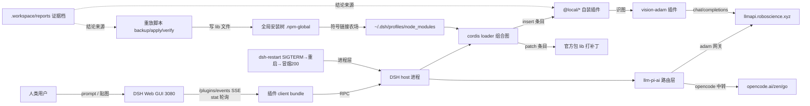
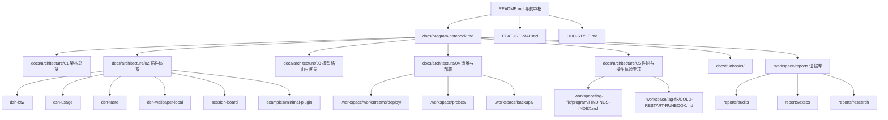
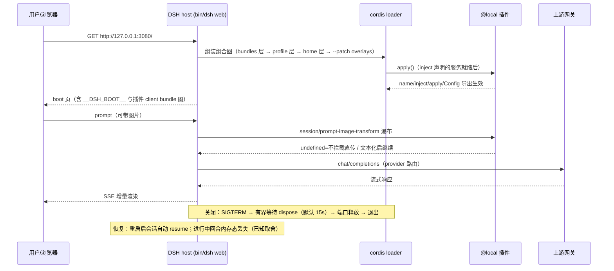

# dsh-hub 程序笔记本（Program Notebook）

> **Tier 0 · 中枢** · [指南地图](../README.md) · [风格约定](../DOC-STYLE.md) · [功能地图](../FEATURE-MAP.md)

本页是 dsh-hub 的**中枢索引与摘要**，回答「这个仓库是什么、东西在哪、现在什么状态、哪里已知有病」。
它不是正文仓库：每个专题的完整内容在 `docs/architecture/`，证据在 `.workspace/reports/` 与
`.workspace/` 下的部署批次目录里。

> **数据时点**：2026-09-23（§0/§1/§2/§3/§4/§5 仍为 2026-09-20 基线；§6 索引、**§7 缺陷表（含 D18–D28）**与 §8 已按 2026-09-23 的性能专项收尾更新）。
> 所有架构事实均取自**当前源码/配置/git**，逐条给出 `path:line` 证据；
> 无法验证的一律标 **未知**，不猜测补全（依据：`program-notebook` skill 的
> `references/maintenance-playbook.md`「不推测」条）。

---

## 0. 一句话定位与归属表

| 职责 | 归属 |
| --- | --- |
| 人类入口、导航中枢、三条规则 | 根 `README.md`（Tier 0） |
| 文档写作约定（状态词汇 / 诚实边界 / 导航表 / 代码块规范） | 根 `DOC-STYLE.md`（Tier 0） |
| 每项能力的**状态与起点**（带日期） | 根 `FEATURE-MAP.md`（Tier 2） |
| **结构/数据流/运行流/配置链/缺陷摘要 + 全库索引** | **本页 `docs/program-notebook.md`（Tier 0 中枢）** |
| 展开型专题（程序结构 / 插件体系 / 模型路由 / 运维部署 / **性能与操作体验专项**） | `docs/architecture/01..05` |
| 操作手册（按场景照做） | `docs/runbooks/` |
| 审计 / 执行 / 复核 / 调研 / 事故 / 验收**证据**与其机器可读产物 | `.workspace/reports/`（Tier 3） |
| 部署包、补丁批次、重放脚本 | `.workspace/workstreams/deploy/` |
| 探针脚本、一次性捕获、预览图 | `.workspace/probes/` |
| 备份（已 gitignore） | `.workspace/backups/` |

判据（可复判）：移除本页后，读者仍能从 `README.md` 知道「去哪找」；但**无法**知道
「模块怎么连、启动怎么走、配置从哪读、有什么已知缺陷」——后者是本页的独有职责。

---

## 1. 全局数据流摘要

只描述本仓库自身的核心调用链，不追踪官方库内部实现。

（实现关系用 `-.->` 与调用/数据流区分。数据流的完整展开见
`docs/architecture/01-architecture-overview.md`；图像链路的 fail-closed 细节见
`docs/architecture/03-model-routing-gateway.md` §图像能力检测。）

---

## 2. 架构摘要

每个节点都参与至少一条连线，无孤立节点。

**关键设计边界（不展开结构体字段）**

- 本仓库是**插件源码 + 补丁批次 + 证据**三合一；DSH 本体不在此仓库（全局安装于
  `~/.npm-global`）。
- 插件**源码仓库 ≠ 运行时装单位**：仓库在 `/home/CNS2026495165/dsh`，运行时在
  `~/.dsh/profiles/node_modules/@local/`（真实目录拷贝，非符号链接）。
- 目录名 ≠ 包名：`dsh-wallpaper-local/` 的包是 `@local/dsh-wallpaper`；
  `session-board/` 的真正包在子目录 `session-board/dsh-session-board/`。
- `dsh-taste/` 是**自写源码**，但占用官方命名空间 `@deepseek-ai/dsh-taste`，且不带
  `dsh.bundle.patch`——不要按「官方包」描述它。
- `pi-taste-analysis/` **不是插件**（无 `package.json`），是调研分析档 + vendored 上游 TS 源码。
  证据见 `docs/architecture/01-architecture-overview.md` §模块清单。

---

## 3. 程序运行流摘要

启动 / 运行 / 关闭 / 错误路径的完整版（含 restart 守卫与 fail-closed 分支）见
`docs/architecture/04-ops-deploy.md` §运行流。

---

## 4. 配置加载链

**从哪加载 → 谁消费**，三层各自独立：

| 层 | 来源 | 内容 | 谁消费 | 生效方式 |
| --- | --- | --- | --- | --- |
| 运行时设置 | `~/.dsh/settings.yaml`（唯一一份；路径规则 = 显式 `path` 优先，否则 `<harness home>/settings.yaml`） | `llm-pi-ai` providers/models、`vision-adam`、`dsh-subagent`、`agent-default-model`、`agent-presets`、`wallpaper`、`dsh-ssh-gui`、`ui-theme` | 各插件宿主侧 + 路由层 | **值级热载**（下一次读取即新值），schema/代码类改动需随插件部署重启一次 |
| 插件组合 | `~/.dsh/profiles/web/cordis.patch.yml`（**运行入口**）叠加 `dsh.profile.bundles` 各 bundle 的 `dsh.bundle.patch` | loader patch 条目：`insert` / id 级 `config` 覆盖 / `disabled` / `!!js` 表达式 | cordis loader | **条目级热载**（约 1s）；`insert` 的 `name` 必须是 **bare 包名**，用文件路径名会 import 失败并整次回滚 |
| 凭据 | `~/.dsh/.credentials.yaml` | `apiKeyEnv` 引用的**值**（`ADAM_API_KEY` / `OPENCODE_GO_API_KEY` / `DEEPSEEK_API_KEY`） | provider 层、vision-adam | settings.yaml **只存引用名**，永不入库；解析顺序 = credentials 服务 → 启动环境变量 → 字面量 `apiKey` |

组合顺序（逐层覆盖）：**bundles 层 → profile 自身层 → home 层 `$DSH_HOME/cordis.patch.yml` →
`--patch` overlays**。

> ⚠️ **已知陷阱（本文档必须写对）**：`dsh-subagent` settings 层是**字段级**覆盖，不是整对象替换。
> 本部署 settings.yaml 只设了 `model`、**没有设 `provider`** ⇒ preset 的 `provider: adam` 被保留，
> 生效路由应为 `adam/deepseek-v4-pro`。`~/.dsh/AGENTS.md` 与 preset 注释里「子代理固定
> `adam/deepseek-v4.1-flash`」的说法**已被 settings 段覆盖**，不得照抄。证据与行号见
> `docs/architecture/03-model-routing-gateway.md` §子代理路由合并层。

---

## 5. 模块摘要

### 5.1 自装插件（本仓库持有源码）

| 目录 | 包名 | 形态 | 一句话职责 |
| --- | --- | --- | --- |
| `dsh-btw/` | `@local/dsh-btw` | host + client | 侧边对话：贴图经 vision-adam 转文本、子代理树/项目总览跳转、面板对齐；默认/清单每次调用热读 |
| `dsh-usage/` | `@local/dsh-usage` | host + client | API 用量统计：面积/柱状/热力图（自绘 SVG）+ 自绘 tooltip |
| `dsh-taste/` | `@deepseek-ai/dsh-taste` | host + client | 偏好记忆；**无 `dsh.bundle.patch`** |
| `dsh-wallpaper-local/` | `@local/dsh-wallpaper` | host + client | 静态壁纸 fork；`dsh.client.immediately = true` |
| `session-board/dsh-session-board/` | `@deepseek-ai/dsh-session-board` | **host-only** | 会话状态看板；无 `lib/client.js`、无 `cordis.patch.yml` |
| `examples/minimal-plugin/` | `@local/dsh-minimal-plugin` | host (+可选 client) | 最小插件脚手架：拷贝 + `insert` 即启动 |
| `~/.dsh/profiles/node_modules/@local/dsh-logfile/` | `@local/dsh-logfile` | **host-only（运行时插件，源码在 `.workspace/lag-fix/exec-logdrift/candidates/`）** | 宿主**日志文件出口**：显式 `levels:{default:2}` + 24 MiB 硬顶轮转 + 永不抛的 `export()`；含孤儿 settings 段巡检（只上报） |

### 5.2 非插件目录

| 目录 | 性质 |
| --- | --- |
| `pi-taste-analysis/` | 调研分析档 + `vendor/pi-taste/`（上游 Pi agent TS 源码，不可挂载） |
| `.workspace/reports/` | 审计/执行/复核/调研/事故/验收证据（Tier 3） |
| `.workspace/workstreams/deploy/` | 部署包 + 补丁批次 + 重放脚本（含 `patches/*.patch` 可执行规范） |
| `.workspace/probes/` | 探针脚本、一次性请求/响应捕获、settings 快照、预览图 |
| `.workspace/backups/` | 备份（`.gitignore` 已排除，只作本机回滚用） |
| `.workspace/workstreams/{sources,baseline-011,plugin-restore,side-deploy,…}` | 移植源副本、基线 tgz、恢复/支线部署批次 |

大型目录不逐文件罗列：模块级细节与调用链见 `docs/architecture/01..04`。

### 5.3 性能与操作体验专项摘要（2026-09-23 收尾）

一次"约 100 条线"的深度审计 + 修复闭环，起因是**用户报的四个体感问题**，落点是**16 项线上改动**：

- **四个问题全部闭环**（用户当面确认）：设置页卡顿「消失」、**刷新后会话列表加载不出「秒开」**（单发 32.6 s/超时 → **0.28/0.17/0.11 s**；并发 4 路**全超时 → 0.90 s 全 200**）、btw 点 X 关闭「不卡了」（74.8% → **0.3%** 掉帧、fps 19 → **59**，**背景模糊原样保留**）、输入框蓝框「消失」。
- **宿主主干的关键机制**：`session.list` 每次调用 **≈8 490 次串行 `await` 且零 memo**，而内在工作量只有 45–70 ms ⇒ **延迟 = 跳数 × 逐跳队列延迟**（削弱化/改体积都是错杠杆）。
- **五条跨线重大发现**：HMR 热刷新时序缺陷（写客户端插件会打断界面，**已修**）、全 DSH **仅 7 个模糊载体**且代价来自"逐次重绘"、`log.warn` 曾是**彻底黑洞**（已修）、bash **恒串行**（已修）、**静默回滚是 `@local/*` 全体通病**（未修，有校验器）。
- **13 条更正清单**（含"zod 5.8×"撤回、`version bump 不丢介质`、`commits÷投影帧` 上界 0.85 等）与**判据纪律**（`[data-slot]` 面积恒 0、"机器安静"门禁不成立、**加速比只认同窗对照**）见专题文档。

完整内容：`docs/architecture/05-performance-and-ux-program.md`；程序级索引与回滚地图：`.workspace/lag-fix/program/FINDINGS-INDEX.md`。

---

## 6. 参考资料索引

索引只给路径与一句话职责，不复制正文。

| 文件 / 目录 | 回答什么 |
| --- | --- |
| `README.md` | 这是什么仓库、从哪里开始、三条规则 |
| `DOC-STYLE.md` | 文档怎么写（状态词汇、诚实边界、导航表、代码块规范） |
| `FEATURE-MAP.md` | 每项能力的状态（带日期）与入口 |
| `docs/architecture/01-architecture-overview.md` | 完整程序结构、模块职责、关键依赖、数据流展开 |
| `docs/architecture/02-plugin-system.md` | 插件契约、组合图装载、hot/cold 边界、settings 槽 |
| `docs/architecture/03-model-routing-gateway.md` | provider/model 配置链、子代理路由合并层、网关、图像能力检测 |
| `docs/architecture/04-ops-deploy.md` | 补丁重放 fail-closed 契约、重启、验收矩阵、测试架构、备份布局 |
| `docs/architecture/05-performance-and-ux-program.md` | **性能与操作体验专项**：四问题前后对照、16 项落地、五条跨线重大发现、13 条更正清单、判据与口径纪律、落地/回滚地图 |
| `.workspace/lag-fix/program/FINDINGS-INDEX.md` | **性能专项程序级索引**：四问题前后实测、16 项落地总表、**13 条更正清单**、诚实口径（加速比只认同窗对照等） |
| `.workspace/lag-fix/COLD-RESTART-RUNBOOK.md` | **重启批次手册**：落地顺序、分离式重启命令、重启后验收链、逐单元回滚、为何"客户端改动要与重启合批" |
| `.workspace/lag-fix/program/w01..w29/` | 逐线审计正文（`audit.md` + 原始 JSON）；结论的唯一出处 |
| `.workspace/lag-fix/exec-*/` | 逐项执行正文（候选件 + 补丁脚本 + `report.md` + `DEPLOY.md` 含回滚） |
| `.workspace/lag-fix/lib/probe-lock.mjs` | 跨线探针锁（**已修死锁**：确证死亡即回收 + 真实 `ageMs` 护栏） |
| `docs/runbooks/switch-web2-runbook.md` | 切换到 web2 独立实例的验收流程 |
| `docs/runbooks/verify-runbook.md` | 合并手工验收清单（btw 8 步 + 壁纸 12 步） |
| `.workspace/reports/runbooks/` | 主题 Runbook：总 Runbook、lag-fix、btw v2、combined-restore |
| `.workspace/reports/execs/` `.workspace/reports/audits/` | 每项能力的执行与审计证据 |
| `.workspace/reports/plans/` | 需求对齐与接线计划（`../.workspace/reports/plans/btw-wallpaper-plan.md`、`../.workspace/reports/plans/wiring-plan.md`） |
| `.workspace/reports/reference/local-api-surface.md` | 本地部署 API 面 vs master 源码差异 |
| `.workspace/workstreams/deploy/*/patches/*.patch` | 官方包补丁的 unified diff（**可执行规范**） |
| `.workspace/workstreams/deploy/deploy-lag/README.md` §9 | 运行时热载能力矩阵（P0-a 实测固化） |
| `examples/minimal-plugin/README.md` | 写第一个插件 |
| `~/.dsh/skills/program-notebook/` | 本页的编写规范（skill 自述 + `references/`）。**2026-09-23 从本仓库 `.dsh/skills/` 移出**到全局用户根 ⇒ 对**全部工作区**生效（此前只在 `dsh` 工作区可见）；发现根与优先级见 `docs/architecture/02-plugin-system.md` §8 |
| `.workspace/lag-fix/research-v2/MEASUREMENT-STATUS.md` | **性能数字可信度单一事实源**：数据分级（可用＝比值/为零/占比；不可用＝绝对 ms）、协议失败实测、撤回清单、并发口径与锁释放顺序 |
| `.workspace/lag-fix/exec-audit/BATCH-PLAN.md` | **落地批次计划**：单元清单／重启分组／闸门 G1–G5／写入者边界／测量协议 7 条 |
| `.workspace/lag-fix/research-v2/theme-fix-ab/BEFORE.md` | 主题修复 A/B 的修复前基线（门禁全通过）与**重新推导后的判据** |
| `.workspace/lag-fix/exec-audit/{ingest,b1,p2,theme}/audit.md` | 四份执行前审计（根因、精确锚点、验收标准、回滚点） |
| `.workspace/btw-question/d30-consequence.md` | **D30 后果实证单一事实源**：多余键穿透链、宿主侧抛点、真机冻结形态（27 次失败读 / 45 s / 唯一出路）、修法 A–F 对比与残留通道；产物目录 `.workspace/btw-question/d30/`（实验输出 + 真机截图） |
| `.workspace/btw-question/exec-d30/report.md` | D30 修法落地报告（U1–U6 逐条、新增 10 测试、反向验真 3 处、构建产物 md5/体积对照、边界合规） |
| `.workspace/btw-question/push-plan.md` | **推送就绪审计**：T1 `.gitignore` 增补逐行 + T2、提交切分方案、风险表 R1–R12（含 D3/R10 仓卫生欠账） |
| `.workspace/btw-question/e2e-cover/report.md` | **四项补测（T1 多选 / T2 换题重挂 / T3 窄屏选项行 / T4 键盘焦点序）真机报告** + D33 几何取证（`raw-*-T3-extra.json`、`t3-geometry-probe.mjs`）；被测版本取证与诚实清单（5 条仍未判定） |

---

## 7. 已验证的实现缺陷与限制

每条都给出当前代码/配置/git 证据；无法验证的标 **未知**。

| # | 缺陷 / 限制 | 状态 | 证据 |
| --- | --- | --- | --- |
| D1 | **子代理路由文档漂移**：`~/.dsh/AGENTS.md` 与 preset 注释称「两阶段统一 `adam/deepseek-v4.1-flash`」，但 settings.yaml 只设 `model: deepseek-v4-pro` 而未设 `provider`，按字段级合并 ⇒ 实际生效路由为 `adam/deepseek-v4-pro` | **未修复**（本页如实记，不代改他人文档） | `~/.dsh/settings.yaml:217-218`；`dsh-tool-subagent/lib/index.js:132-134`；`~/.dsh/.agent-presets/standard-glm/agent.cordis.yml:193-195` |
| D2 | **`workflow` 无默认模型常量**：preset 里 `workflow-worker-thread` 只声明 `provider: spawn`，模型继承父代理——「workflow 默认模型」在本仓库**不存在**，历史文档若写具体模型即为臆造 | 已澄清（本页定性） | `~/.dsh/.agent-presets/standard-glm/agent.cordis.yml:230-233` |
| D3 | **`deploy-slots/backup-*` 与 `.workspace/workstreams/deploy/deploy-015/` 未被 gitignore**，与 `.workspace/backups/*` 的排除规则不一致（备份内容会进 HEAD 跟踪）。**2026-09-23 更新**：`.gitignore` 的**推送就绪审计 T1 段已落地**（`.gitignore:72-94`，依据实测「未跟踪 13 808 文件 / 5 599.9 MiB，`git add -A` 会一次性入库 3 个真实密钥」）——增补类别：① 凭据与私有索引（`**/.credentials.yaml`、`**/.credentials.yml`、`**/btw-index-backup-*.json`，后者含 `parentTitle`/`parentCwd`）；② pnpm 内容寻址存储 `.pnpm-store/`（553 文件 / 18.93 MB）；③ `*.mgc`（`file -bC` 在 cwd 的编译产物）；④ 逐窗原始会话转储 `.workspace/lag-fix/**/*.zstd`（8 512 个 / 合计 4.7 GiB）；⑤ 逐窗 `*projcache.json` 快照（单份 11.5 MB）；⑥ 修复前 `lib/` 镜像与 profile 快照 `preimage-*`（**含 `.workspace/btw-question/preimage-*/`**，与 `.workspace/backups/` 排除同例 ⇒ 回滚钩子属本机件、不入库）。**D3 本体仍未处理**：`deploy-slots/backup-*` **2 文件**、`deploy-015/` **447 文件**仍**被跟踪**，加 `.gitignore` 行不会使其脱离跟踪 ⇒ 须 `git rm -r --cached` + 单列批次（会改动 HEAD 体积 13 MB，需独立验收）。 | **未修复**（T1 增补已落地；D3 本体仍欠账） | `.gitignore:22-23`（只覆盖 `.workspace/backups/` 与 `.workspace/workstreams/deploy/deploy-lag/backup-*/`）、`.gitignore:72-94`（T1 段，**已落地**）；`git ls-files \| grep -c 'deploy-slots/'` = 10（其中 `backup-20260915-162522/` 2 文件）、`git ls-files \| grep -c 'deploy-015/'` = **447**；审计依据 `.workspace/btw-question/push-plan.md` §「建议 .gitignore 增补」T1/T2 与 R5/R7 |
| D32 | **R10 仓体积历史欠账（新登记，与 D3 同型的"路径漂移改了一半"）**：HEAD 树含 **4 个 >10 MB 跟踪 blob**——`.workspace/tmp-ppt-research/raw/mgr.tgz` **51.1 MB**（最大，已接近 GitHub 50 MB 告警线但未达 100 MB 硬上限）、`incident2/…/real-settings-trace-2.json` 37.3 MB、`real-settings-trace.json` 24.9 MB、`incident2/…/gecko-tree.json` 18.6 MB（总树 370.6 MiB / 5 955 文件）。根因与 D3 同型：`.gitignore:16` 已随 2026-09-20 目录重构改指向**新路径** `.workspace/workstreams/research/tmp-ppt-research/`（重构对照见 `.gitignore:37`），但**旧路径的已跟踪对象仍留在 HEAD**——磁盘上旧路径**已不存在**，`mgr.tgz` 实体（53 561 751 B）现在新路径且被 `.gitignore:16` 命中；`git ls-files` 的旧路径命中 **0**（工作树已净，欠账纯在 HEAD 历史） | **未修**（登记；属独立"仓体积治理"议题，不阻断本批推送） | `git rev-list HEAD --objects \| git cat-file --batch-check=… \| awk '$1=="blob" && $3>10485760'` → 4 条（最大 51.1 MB，逐条复现）；`git check-ignore -v .workspace/workstreams/research/tmp-ppt-research/raw/mgr.tgz` → `.gitignore:16`；`.workspace/btw-question/push-plan.md` R10 |
| D4 | **btw 备份 ≠ live 态**：现有备份不含后续单元，`--rollback` 会连带退掉后续改动；验收记录已标黄灯 | 已知限制 | `.workspace/reports/execs/acceptance/acceptance-exec.md` §3.1 |
| D5 | **R1 红灯未落地**：回滚 glob `…index.js.bak-*.bak` 展开 0 文件的问题号称「纳入文档回写」，但仓库此前无 `docs/`，修复尚未落地 | **未修复** | `acceptance-exec.md` §3.1；本页所在目录即该回写的落点 |
| D6 | **真机面未实测**：`ws_serial_*` / `ws_flash` 只过本地单测与静态加载；分布式控制（SSH / 真串口 / serial-tcp）未真机 | 已实现·**未真机** | `FEATURE-MAP.md` §一；`.workspace/reports/execs/workerspace/workerspace-exec.md` |
| D7 | **B 通道热载未投产**：纯函数模块热载机制实验通过，但投产需改官方 `cordis-plugin-hmr` + 一次重启落地（鸡生蛋） | **尚不可用** | `FEATURE-MAP.md` §三；`.workspace/reports/execs/p0-hotload/p1-hotswap-gate-exec.md` |
| D8 | **`replay-lag-fix.sh` 头部注释「本环境 pnpm 不可用」已过期**（pnpm 二进制存在，只是无工程可 build） | 文档漂移，**未修复** | `.workspace/workstreams/deploy/deploy-lag/replay-lag-fix.sh:28` vs `acceptance-probe` 侧审计结论 |
| D9 | **`session-board` 包的实际部署位置未确证**：`@deepseek-ai/dsh-session-board` 未出现在 `~/.dsh/profiles/node_modules/@local/` 列表中 | **未知** | `ls ~/.dsh/profiles/node_modules/@local/`（本轮取证未见该包） |
| D10 | **`install — models 段不完整的历史教训已修复但机制仍脆弱**：adam 曾 45/50 条目缺 `contextWindow` → 回落 262144 触发误判超窗；现按保守档补齐，但**新增模型若漏写 `contextWindow` 会再次踩坑** | 已修复（机制性风险仍在） | `acceptance-exec.md` §3.6；`dsh-llm-pi-ai/lib/index.js:849`（`DEFAULT_CONTEXT_WINDOW = 262144`） |
| D11 | **btw vitest 存在负载敏感 flake**（已加固为首跑 1 failed / 隔离 10/10、全量复跑 3/3 全绿）——不得写成"测试全绿"或"存在回归" | 已加固 | `acceptance-exec.md` §3.2；`dsh-btw/tests/host-opening.spec.ts:145` |
| D12 | **设置页卡顿：根因已从"会话链"改判为客户端主题重放 + 宿主 ingest**。8 条独立审计 + 独占复测结果：① **客户端第一位成本项 = `dsh-client-ui-layout` 的 `ThemePresenter.apply`**（`theme-presenter.js:366`；独占批占非 idle **72.9%**、受污染批 78.6%，**是整条会话链的 44.9×**，触发源是 `ctx.on("theme/change")` 而非 session 事件；每次调用含 **1 次 `getComputedStyle(body)` 强制全文档重算**，成本随 DOM 规模超线性）。② 会话投影链（`buildListSnapshot`/`projectList`/`list.set`）仅占非 idle **1.6%** ⇒ **原"首要机制"被证伪**。③ 单个设置标签内容渲染、C2 全树扫描、usage 首挂载 **均已证伪**（模型面板 12/12 窗 0 fiber；`rebuildRemote` 0 命中；9 路请求 0/591 掉帧）。④ **口径**：历史"设置页 script 80–190 ms/s"系并发污染，实测膨胀 **Script 4.5–10.3×、apply 9.6–20.5×**；`Layout` 仅独占批可测。 | **主题批待落地**（候选与实验脚本产出中）；R4 已落地。**2026-09-23 更新：设置页卡顿已闭环**——遮罩 blur 移除后由**环带方案**恢复观感（差异 0.0235% >2/255、人眼不可辨；交互相 LoAF **45 → 1**），详见 `docs/architecture/05-performance-and-ux-program.md` §2 | `research-v2/MEASUREMENT-STATUS.md`；`research-v2/cpu-profile/audit.md`；`research-v2/theme-fix-ab/BEFORE.md`；`reports/settings-jank-audit-synthesis.md` |
| D13 | **usage 45s ingest 定时器从未触发**（自启动起冻结，实测跨 ≥117 个周期；R4 之前即存在）。根因：`dsh-usage` 的 `inject` **无 `"timer"`**，而 `ctx.setInterval` 是 timer 服务 mixin accessor ⇒ `typeof ctx.setInterval` **读取即抛** `cannot get property "timer" without inject`；因 `A ? B : C` 先求值 `A`，`ctx.effect` 兜底**语法上不可达**（与 D14/9-20 事故同属"死掉的兜底路径"）。**修法形状**：`ctx.inject(["timer"], cb)`，不得保留 `typeof` 探测。**铁律：必须先让 ingest 离开主线程（G1：单 pass 宿主事件循环最大延迟 <100ms）再启用**，否则变成每 45s 冻 2.7s | **未修**（U-IG1 先决）。**2026-09-23 更新：已修并启用** —— `U-CB1` 让 `/usage/refresh` 走到**结算尾部**（`lastIngest` 现在会前进，活体实测 `推进=true`）；`U-CB2` 已开启 **45 s timer**，安静窗验收 **ACCEPT**（worst 678 ms、0 拍 >1000 ms；首次 REJECT 已确认为**测量方自身负载污染**） | `exec-audit/ingest/audit.md` §1；`research-v2/ingest-gate/verdict.md` |
| D14 | **CC ingest 游标 off-by-one ⇒ 静默丢记录**：`ingest-cc.js` 的 `consumedBytes` 在文件以换行结尾时**多算 1 字节** ⇒ `last_offset = size+1` ⇒ 下一轮 `subarray(size+1)` **跳过新内容首字节**，追加批次首条记录解析失败被丢弃（表现为 `failedFiles:"1 unparsable JSON lines"`，每轮复现）。生产 388 条 `sync_state` 行**逐条**满足 `= size+1`。**已修**（source：`consumedBytes` 分支 + 遗留 `size+1` 游标夹回 `state.size` 自愈），复现 `LOSS_CONFIRMED → NO_LOSS`、迁移 `SELF_HEAL_PASS` | **source 已修；deployed 待落地**（脚本就绪） | `research-v2/cc-cursor/audit.md`；`exec-audit/ingest/audit.md` §4 |
| D15 | **`rebuildDailyForDays` 重复键**：DELETE 集合 = 传入的**非连续** day 集合，而 INSERT 的 SELECT 用 `[min, max+1day)` **连续区间** ⇒ 区间内"间隙日"未删却被 GROUP BY 重新产出 → 裸 INSERT 撞 `UNIQUE(day,data_source,model,project)`（空库全量 11/871 文件；生产 1 例）。**不产生错数字**（`usage_daily` 仅 `queryHeatmap` 读且带新鲜度闸门会回落 raw events），但会让日聚合沿旧值停住。修法：**区间对齐** 或/与 `ON CONFLICT … DO UPDATE` | **未修** | `exec-audit/ingest/audit.md` §2 |
| D16 | **P2 address-chain stale row**：`projectList` 在 ids 不变时把旧 `byId` 中当前缺失的键**无差别回拷**，且 byId 整体身份复用未校验键集 ⇒ 已剪掉 scope 的 synthetic child 残留在投影里，被后代聚合读取。**已修（deployed 已落地，热面）**：链域回拷 + 键集闸门（`/* p2ac-fix */` ×4；`357f1703…`），58/58 变体对拍 + 18/18 harness 双态 + 反向对照 6/6 | **已修** | `exec-audit/p2/audit.md`；`exec-p2/report.md` |
| D17 | **B1 冷路径排序与 running 计数两处缺陷**（承接 B1 补丁）：① 冷候选排序用 header **不存在的 `updatedAt`** ⇒ 比较器恒 `NaN` ⇒ 实际为 `readdir` **枚举顺序前 200**（丢的是整行）；② `runningSubagentCount` 有**两条丢弃通道**（收口截断 + attached keep-set 无 running 豁免）。**已修（deployed 已落地，冷面待重启）**：`?? createdAt` + id 消歧；`childrenOf` 改由 `ctx.sessions.list()` 构建。反事实 18/18（201 几何 0→1）；A6 活体断言待重启后验 | **已修，待重启生效**。**2026-09-23 更新：已重启生效**，且根因被同批审计进一步分解为**每次调用 ≈8490 次串行 `await` 且零 memo**（详见 `docs/architecture/05-performance-and-ux-program.md` §2）：单发 **32.6 s/超时 → 0.28/0.17/0.11 s**、**并发 4 路全超时 → 0.90–0.92 s 全 200** | `exec-audit/b1/audit.md`；`exec-b1/report.md` |
| D18 | **HMR 热刷新时序缺陷**：写任一客户端插件的 `lib/client.js` ⇒ 宿主经 SSE 推 `rebuilt` 帧 ⇒ `reload()` **先清 `entry.fiber`（连带注销其服务）→ 删自带 `<style>` → 重新 apply**，而**依赖该服务的槽条目在该窗口内先重挂** ⇒ 抛 `xxx service unavailable` ⇒ **该插件 UI 整体不渲染、其它插件照常**（用户表现为"会话区整片空白"）。实测：**仅追加一个注释**即触发；Console 原文 `slot entry crashed in 'conversation.session'`。**已修**（槽错误边界上的**有界延迟重挂 + 窗口期不 abdicate**，含"真缺失服务仍如实报错"的阴性对照） | **已修并落地** | `docs/architecture/05` §4.1；`.workspace/lag-fix/exec-hmr/report.md`（含 SSE 原始帧与选型对比） |
| D19 | **`log.warn` 是彻底黑洞**：阈值 = `levels?.default ?? this.level ?? 1`，内置 exporter 无 `levels`、三层活跃 patch 与 home 层均无 `logger:` 条目 ⇒ 阈值 = 1，而级别为 `error=0/info=1/warn=2/debug=3` ⇒ **`warn`/`debug` 连环形缓冲都进不去**（离线实跑只收 `["error","info"]`）⇒ 既有 8 处 `log.warn` 全部无效。**已修**：新增宿主文件 exporter `@local/dsh-logfile`（显式 `levels`、24 MiB 硬顶轮转、`export()` 永不抛）⇒ `~/.dsh/logs/dsh-host.jsonl` 已在落盘 | **已修并落地** | `docs/architecture/05` §4.3；`.workspace/lag-fix/exec-logdrift/report.md` |
| D20 | **`runningSubagentCount` 有两条丢弃通道**（不只是审计说的第一条）：① `dsh-client-connection` 的 `sessionSummarySchema` 无 `.passthrough()`（宿主写 99/99 → 解析后 0/99）；② `dsh-client-runtime` 的 `projectList()` **byId 显式字段白名单**与 `stableById` 复用谓词都不含该字段 ⇒ 字段在第二处再次丢失，UI 永久走弱兜底（**深层/未加载子代理树被低报或报 0**）。**已修**（两处都补）⇒ 真 505 KB payload + 真 schema + 真 UI 谓词实测 **L1–L4 全通、低报 0、缺口 0** | **已修并落地** | `docs/architecture/05` §3；`.workspace/lag-fix/exec-countfix/report.md`（含 L0→L4 链路探针） |
| D21 | **bash 恒为 exclusive**：`dsh-tools` 的 `isConcurrencySafe` 全树仅 5 个声明点，**`dsh-tool-bash` = 0** ⇒ 同一消息内多个 bash **严格串行**（区间逐段首尾相接、峰值并发 1、0/15 重叠、`span/Σ=1.0002`）。**已修**：只读命令白名单式**条件声明**（默认不声明；写路径与危险形状保持 exclusive；带环境变量/哨兵文件开关，可零重启翻转）。同窗真数字 **4.67×（1 s 载荷）/ 1.44×（50 MB grep）**；**审计的 8.17× 是高负载窗口上限，不是稳态收益** | **已修并落地（冷面）** | `docs/architecture/05` §3/§6；`.workspace/lag-fix/exec-bashconc/report.md` §11 |
| D22 | **btw 每次打开抽屉都发一条不可见的 `sideChat/listTree`**（`view.jumpOpen` 全程 false）：实测 13 次、**单次最长 22 237 ms**、Σ≥**56.3 s** 宿主工作；另有 **1/6 复活竞态**（抽屉消失后 +32 ms 复活，直到 close 落地 2 644 ms 才真消失）。**已修**（U4 加 `jumpOpen` 守卫；U3 把 `viewStore.clear()` 提到 `await close()` 之前） | **已修并落地** | `docs/architecture/05` §3；`.workspace/lag-fix/exec-btwclose/report.md` |
| D23 | **shell 三段手柄四处缺陷**：① 右键按下会 `dragging=true` 并**真改布局**（280→360）；② 四类取消投递路径（touchCancel/释放捕获/合成 pointercancel/lostpointercapture）**均不复位**；③ **拖拽中手柄被卸载 ⇒ `data-dragging` 永久残留**（跨 pointerup 与重新加宽，仅 reload 能清）；④ **170 px 死区**（静态档的"140px"是阈值不是死区）。**已修**：①–④ 全部修复（死区 **170 → 10 px**），并加手柄**键盘可达（Tab 命中 0 → 2）+ 可视提示 + 列宽持久化**；2 149 392 组等价性穷举 0 差异 | **已修并落地** | `docs/architecture/05` §3；`.workspace/lag-fix/exec-shellfix/report.md` |
| D24 | **projcache 整文件重写 + 孤儿**：每次写一条记录**全量重写**（单次 52 ms：serialize 25.9 + writeAtomic 19.2，其中 UTF-8 编码占 32.6%），写放大 **21.11 MB/s**；记录 3 104 vs 盘上会话目录 1 443 ⇒ **孤儿 57%**、无淘汰。**已修热面两项**（紧凑序列化 + 同 interval 合并发布）⇒ 线上实测 **发布 1.84 → 0.36 次/s、写放大 → 1.96 MB/s、文件 11.5 MB → 5.42 MB**；**per-record 分片布局与孤儿回收未做**（方案已备） | 热面两项**已修并落地**；分片/回收**未做** | `docs/architecture/05` §3；`.workspace/lag-fix/program/w21-storage/audit.md` |
| D25 | **静默回滚是 `@local/*` 全体通病 + 恢复脚本覆盖缺口**：8 包中 **7 包**有 deployed-only 手改；全局恢复器 `deploy-lag/replay-lag-fix.sh` **只覆盖 5 包**，对 `dsh-client-runtime`/`ui-settings-general`/`ui-renderer`/`dsh-client-hmr`/`dsh-client-modules`/`@local/dsh-usage` **命中为 0** ⇒ `npm i -g` 升级后这 6 类补丁**静默丢失且无校验**。另：`side-deploy/deploy-side.sh` 曾**默认真跑**且指向旧快照（一次误执行会回滚多项成果）⇒ **已加安全闸门**（默认 dry-run + 必须 `--apply` + 事前/事后指纹闸门） | **未修**（已有**漂移校验器**可发现：52 包/322 文件，实测 **17 处漂移/9 包**） | `docs/architecture/05` §4.5；`.workspace/lag-fix/exec-logdrift/drift/` |
| D26 | **GUI 无 URL 深链、宿主无"按 id 打开"接口**：壳层 bundle 内 `history.pushState`/`location.hash`/`/session/` **命中均为 0**（该版本开会话走 HTTP `/api/*`）；侧栏搜索可达集合不全（实测某含图会话既不在列表也不在搜索结果） ⇒ 长会话与含图会话**无法在不写数据的前提下被触达**（导致两项审计保留 INCONCLUSIVE） | **未修**（已知限制） | `docs/architecture/05` §8；`program/w25-conversation/audit.md`、`exec-blurfix/report.md` §6 |
| D27 | **`data-plugin` 归属按"物化时刻"认领**（`dsh-client-modules` 全仓唯一打标点）× `removeOwnedStyles` ⇒ **跨插件样式误删风险**：机制确证，**可达性 INCONCLUSIVE**（现有插件均用 `data-plugin-css` 幂等标记） | **未修**（登记） | `.workspace/lag-fix/exec-hmr/report.md` §7.2 |
| D28 | **跨线探针锁死锁**：旧 `probe-lock.mjs` 在属主**已确证死亡**时也拒绝回收（返回误导性的 `BUSY_UNKNOWN_LIVENESS`），且 `ageMs` 恒为 0（`minAgeMs` 是死代码）⇒ 一条线崩溃会**永久阻塞所有兄弟线**（实测让某线白等 900 s）。**已修**：整行全局正则解析（值含空格不再截断）+ **默认按确证死亡回收** + 真实 `ageMs` 抗竞态护栏 | **已修** | `docs/architecture/05` §7；`.workspace/lag-fix/lib/probe-lock.mjs` |
| D29 | **btw 问答卡片：点选后选中态 ~220 ms 即被抹掉，且选项行语义/观感与主会话不一致**。根因：`QuestionCard` 的重置 `useEffect` 依赖 `[questionId, pendingQuestion.questions]`，而 `questions` **每次 `sideChat/read` 都换身份**（跨 JSON RPC + strict codec 的 `schema.parse` 逐次重建对象图），提问待答期间 `running` 恒真 ⇒ controller 每 **220 ms**（`controller.ts:723`）publish 新快照 ⇒ 该 effect 以 ~4.5 次/秒跑 `setDrafts(全空)`。修法采**官方同款**（官方 `dsh-client-ui-user-questions` 卡片**零 `useEffect`**，靠重挂保草稿——编译后为 `jsx(QuestionFlow, { pending: question, t: props.t }, question.key)`，**第三参即 React key**）：删除重置 effect + 调用点 `key={questionId}`（host 每次提问 `randomUUID()`，不复用）；选项行 ARIA 由 `aria-pressed` 改为官方契约 `role=radio\|checkbox` + `aria-checked`（原结构在 `radiogroup` 里用 `aria-pressed` **不合法**），并加单选项序号徽标 / 多选复选框、去掉硬编码绿 `#b7e85b`、对齐官方实测 token（选中底 `--dsw-alias-interactive-bg-hover` + 边 `--dsw-alias-border-l2`、`min-height:40px`、`radius:12px`、`padding:8px 12px 8px 8px`）。**`.questionCard` 外壳（绿描边/绿点脉冲/绿底）按用户裁决原样保留**。**代码/构建/测试已完成**：`dsh-btw` 全量 vitest **25 files / 250 passed / 2 skipped**（首跑，无 flake）；C1 回归锁已验证（注入旧 effect 必失败，独立交叉审计复核为「C1 轮询后断言必失败、删 `key` ⇒ C2 必失败，且均已字节还原」）。**未记录的行为变更（漏项 a）**：删除该重置 effect 时，其体内的 `setError(null)` **一并移除** ⇒ **提交错误不再被轮询清空**，会驻留到下次提交或换题重挂（属改善，但如实记录）。**部署与真机验收（2026-09-23 完成）**：终版 served md5 `88de97e6c22fc6de9ebd61cb27e5779f` / 363 814 B / `?rev=3980d1322992`（响应头 `cache-control: no-cache` ⇒ 普通刷新即取新字节；部署位与仓库逐字节相同；**未重启 dsh**）。**真机 E2E 已验收**（headless Chromium 驱动真实 GUI 抽屉 + 真实 `btw_ask_user` 提问；点选后每 50 ms 采样 3 s）：修复前 `REVERTED firstOn=166 ms firstOff=270 ms on=2/56` ⇒ 终版 **`PERSISTED firstOn=185 ms firstOff=null on=55/55`**。**U8 观感增强（用户裁决）**：仅靠官方选中底（6% 中性覆盖）在绿壳卡片上实测全行均差仅 **13.01/255**、易被读成"没选上" ⇒ 选中时**序号徽标翻成 btw 绿实心 + 深色数字**（徽标区均差 53.55/255、峰值 151；先试官方主色近黑实心，识图复核对绿壳判"突兀"，用户改选绿）。并补齐最后一处官方偏差：选项**基态文字改主色** `--dsw-alias-label-primary`（官方两态均 `rgb(15,17,21)`，btw 原为次级灰、会被读成"禁用"）。**有意保留的偏离**：基态边框 `--dsw-alias-border-l2`（官方 transparent）、显式「发送回答」提交（官方单选点击即提交）、`gap 6px`/字号 13px（官方 1px/14px，抽屉尺度）、卡片绿壳。 | **源码已修 + 已回归锁定 + 已部署 + 真机已验收**（热面，无需重启 dsh） | `dsh-btw/src/client/SideChatSurface.tsx`（`QuestionCard`）、`dsh-btw/src/client/side-chat.module.css`；`dsh-btw/tests/side-chat-surface.spec.tsx` C1–C5；`.workspace/btw-question/`（`plan.md`、`audit-a/b/c`、`xaudit-code.md`、`xaudit-docs.md`、`exec-report.md`、`e2e/*-before.json`、`e2e/*-final.json`、`e2e/*-optvisual.json` + 截图、`harness/`） |
| D30 | **btw `btw_ask_user` 的题目项 schema 与 read 结果的 codec 宽度不一致**：工具侧 item schema 是 `additionalProperties: true`（`dsh-btw/src/host/side-chat-service.ts:916` 题目项、`:926` 选项项），`execute` 用**类型断言**（`:961`）把模型参数直接塞进 pending（`:980`），而下发走 **strict codec**（`dsh-btw/src/remote-descriptors.ts:32-34` 的 `result.mode='strict'` → `readSideChatResultSchema` → `btwQuestionSchema`/`btwPendingQuestionSchema` 均 `.strict()`，`dsh-btw/src/shared/remote.ts:146,153`）⇒ 模型多带一个未声明键（例如照抄官方心智写驼峰 `multiSelect`、或加官方才有的 `detail`）会**穿过工具校验、存进 `entry.pendingQuestion.questions`，然后在 `sideChat/read` 的结果校验上炸掉**（宿主抛 `TypertGatewayError(code='result-invalid')`，经 `rpcFailure` 泛化成 `code:"internal"` + "business result failed boundary validation"）。**精度修正（2026-09-23 实测）**：修复前只有**题目项**外层有 `.strict()`，`options` **内层非 strict** ⇒ **选项项**多余键是被 **静默 strip（不炸、丢字段）**，**爆点只在题目项层**；本轮已给选项项补 `.strict()`，两层语义一致。另：工具 schema 的 JSON-schema DSL **不支持 `minLength`/`minItems`** ⇒ `id:''` / `question:''` / `options[].label:''` / `questions:[]` 这类**值维度**宽度差**关不掉 `additionalProperties`**，只能靠 `execute` 内 codec 自校验。**真机实测后果（2026-09-23，已构造出条件）**：模型多带未声明键后该 btw 的 `sideChat/read` **整体**失败（不是只丢这一问）⇒ 客户端 `poll()` 只 `console.warn` + 1 200 ms 退避、**不 publish**（`dsh-btw/src/client/controller.ts:774-787`，原 D29 版为 `:741-746`）⇒ 抽屉**冻结在最后一次成功快照**：跑马灯恒停「输出中… · 当前动作: btw_ask_user」、**无问答卡片、无报错、无消息更新**，**唯一出路是按「停止」**（按下后 14 s 内零失败读、DOM 回到 `running:false`，证明 read 恢复）；**「收起→重开抽屉」无效**（走 `open()` 早退分支 `:126-130`）。实测数字：**27 次失败读 / 45 s 观测窗**、warn 间隔**中位 1.475 s**（min 1.203 / max 3.132）、`questionCard=false`、子代理阻塞。**修法（用户裁决：工具边界 codec 自校验 fail-closed）**：① `execute` 内用与下发同一 schema（`btwPendingQuestionSchema.safeParse`）自校验，失败抛**可纠正**错误（含 issue path/code + 合法键清单 + `multi_select` snake_case 提示、**不回显 payload**）且**不写 pending**；② 选项项补 `.strict()`；③ 值维度必须走该 codec（DSL 表达不了）。客户端同批加固：连续 read 失败阈值 3 时给出**非阻塞**提示「实时更新已暂停，正在重试」（locale 键 `drawer.readRetrying`），成功读自动清除、`phase` 仍为 `open`（保持轮询与自愈）。 | **已修（源码 + 构建 + 部署就位）；宿主侧 ⇒ 待重启生效**（`dsh-btw/lib/index.js` 已部署但宿主进程启动于 10:09:52，早于 18:23 的部署 ⇒ **未生效**）；客户端面热已生效 | `dsh-btw/src/host/side-chat-service.ts:916,926,961,980`（修法落点 `:55` import、`:397` 错误文案、`:1004-1005` `safeParse`+throw、`:1021` 存校验后对象）；`dsh-btw/src/remote-descriptors.ts:32-34`；`dsh-btw/src/shared/remote.ts:141-148,146,153`；`dsh-btw/src/client/controller.ts:38,73,107,659,709,754,761,774-787`（catch 分支：`:775` `console.warn`、`:781-784` 阈值 publish、`:786` 退避 `1_200`）；`dsh-btw/src/client/SideChatSurface.tsx:515-519`；`dsh-btw/src/client/locales.ts:8,38,78`；`dsh-btw/tests/host-opening.spec.ts:490-614`（新 7 例）；`dsh-btw/tests/controller.spec.ts:805-893`（新 2 例）；`dsh-btw/tests/side-chat-surface.spec.tsx:893-913`（新 1 例）。实测取证：`.workspace/btw-question/d30-consequence.md`、`.workspace/btw-question/d30/`（`exp1/exp2/exp3/exp6/exp7/exp8` 输出 + `probe3/probe4` 截图）、`.workspace/btw-question/exec-d30/report.md`；审计原文 `.workspace/btw-question/audit-b-official-ui.md` §4.3。**构建产物**：`dsh-btw/lib/client.js` = `66beb3455c59f4991355f3918228e495` / 365 269 B / `?rev=887a12106dcd`（**served == 部署位 == 仓库**，热面已生效）；`dsh-btw/lib/index.js` = `e1437b3ba7de953811e65c47d5b392e5` / 67 542 B（**已部署，宿主未重启 ⇒ 未生效**）；上一版 `88de97e6c22fc6de9ebd61cb27e5779f` / 363 814 B 与 `6ae7bfcf42fe49763a192c54c5f87c02` / 65 970 B。**回滚钩子**（现场 pre-image，仅本机、不入库）：`.workspace/btw-question/preimage-lib-20260923-182907-pre-D30/`（含 `SHA256SUMS.txt`） |
| D31 | **btw `answer` 方向缺"语义校验"**（登记项，与 D30 无因果）：官方 `ask_user_question` 在答案侧除宽度校验外还有 `matchesQuestions` 语义校验——答案条数必须等于题数、逐条 `id` 顺序一致、`selected` 不得重复、`custom` trim 后不得为空、非多选时最多 1 项且不得与 custom 并存、`selected` 的每个 label 必须存在于该题 `options[].label` 集合中（官方 `@deepseek-ai/dsh-api-gateway/lib/index.js:1379-1393`）。btw 的 `answer`（`dsh-btw/src/host/side-chat-service.ts:1157-1172`）**唯一校验是 `:1162-1164` 的 `questionId` 是否匹配**，上述任何一条都没有。宽度方向**一致**（请求 codec `dsh-btw/src/shared/remote.ts:215-219` 内嵌 `:157-161` 全 `.strict()`；工具 output schema `dsh-btw/src/host/side-chat-service.ts:938-957` 两层 `additionalProperties: false`；宿主在 `:984-987` 又显式重建三键对象）⇒ **不是 D30 同类通道**，属"照抄官方时有一步没抄"的登记 | **未修**（登记；对 D30 无因果） | `.workspace/btw-question/d30-consequence.md` §F.0「额外发现」与 §F.4(b)；官方 `@deepseek-ai/dsh-api-gateway/lib/index.js:1379-1393`；btw `dsh-btw/src/host/side-chat-service.ts:1157-1172` |
| D33 | **窄屏 bottom-sheet 下抽屉内容溢出、控件不可达**（**用户裁决：本轮不修、另开一轮**）：640×800 下 `#dsh-btw-drawer` `clientHeight≈370` vs `scrollHeight≈633`（**transcript 只剩 54 px 滚动窗**；泳道高度两次独立会话均 ≈372 px）⇒ **「停止」按钮与抽屉输入框的中心点落在视口外**（`elementFromPoint=null`，实测**中心点 y≈995 / 986**，即二者 box 顶边 `y=980 / 962` ＋ h/2；卡片「发送回答」box 顶边 `y=872` 同样在视口外），必须滚动才能看到完整卡片；**1440×900（`right` 模式）一切正常**（`drawer 12..888`、`stop y 817..847`，全部 `centerInViewport=true`）。**根因（本档已核对源码）**：自动路径的车道高度沿用既有公式 `BOTTOM_SHEET_RATIO=0.48`×可用高度，并夹在 `clamp(…, min(280, available), 560)`（`dsh-btw/src/client/overlay-placement.ts:86-88` 常量、`:396-407` `sheetHeight()`，`:402-406` 为非显式分支），**而抽屉自身内容高度可超过该值**；`HANDLE_MIN_VIEWPORT=720` 以下**刻意沿用旧行为**（`dsh-btw/src/client/drawer-size.ts:41-46`：不渲染拖拽手柄、渲染时不套用显式尺寸 ⇒ 正好落回公式泳道）⇒ 与 HEAD 逐字相同，**不是本批引入的回归**。**不是「scrim 吞点击」**：scrim 是抽屉的前一个兄弟、选项行与「发送回答」均命中自身（T3 PASS），故本条与 T3 的 PASS 不矛盾。**未判定**：其它窄屏尺寸/高度是否复现、边界位置、以及"滚动抽屉内部容器能否把 composer 带回视口"（实测滚到底后 `submit`/`composer`/`stop` 仍在视口外） | **未修**（已实测；用户裁决另开一轮） | `.workspace/btw-question/e2e-cover/report.md` §2.4 + 同目录 `raw-2026-09-23T10-45-10-835Z-T3-extra.json`（三态几何：1440×900 / 640×800 / 滚到底）与复现脚本 `t3-geometry-probe.mjs`；旁证 `raw-2026-09-23T10-40-44-836Z-T3.json` 的 `hitTests.stop`；源码锚点 `dsh-btw/src/client/overlay-placement.ts:86-88,396-407`、`dsh-btw/src/client/drawer-size.ts:41-46` |

---

## 8. 未验证项（本页明确不声称）

1. **已确证（2026-09-23）**：`dsh-subagent` 缺 `provider` 时的运行时实际路由 = **`adam/deepseek-v4-pro`** —— 活体 `settings.describe` 返回 `base={adam, deepseek-v4.1-flash}`、`user={model:deepseek-v4-pro}`、**`value={adam, deepseek-v4-pro}` / `applies:"live"`**（`program/w16-llm/audit.md` §⑤）。D1 由推论升为实测。
2. `opencode-go` provider 的内置 catalog 实际 `baseURL`/`api` 取值未打开确认（settings 里只有 `apiKeyEnv`）。
3. **已确证（2026-09-23）**：浏览器收到 client bundle `rebuilt` SSE 帧后**会自动热重载**（抓到原始帧 `{"type":"rebuilt","id":"@deepseek-ai/dsh-client-ui-conversation","rev":"…"}`，并复现了热重载窗口内的依赖方崩溃 ⇒ 见 D18）。**该重载不会自动刷新已挂载的 React 树之外的状态**：修复后仍需"写客户端 ⇒ 刷新一次"的批次化习惯。
4. `session-board` 的运行时装单位（见 D9）。
5. cordis 内核 `Entry.update` / `_patchContext` 的逐行实现未读，热载机制描述以实测与官方包注释为准。
6. **D26**：长会话（>102 行）与含图会话的渲染/模糊成本未测（无深链、无按 id 打开接口）。
7. **`attachment` 的两个 lightbox 模糊载体**：A 类身份为几何+机制推断，**帧收益未测**（触达不到含图会话）。
8. **D27 的可达性**：跨插件样式误删是否在真实插件组合下可发生，未构造出可达路径。
9. **`ctx.effect` 的返回值形状**只按实现中段 + JSDoc 判断；`fs.WriteStream` 无 `unref()` 是实测，但"句柄回收时机"未逐帧观测。
10. **45 s timer 的长期影响**只有 3×120 s 窗的验收（ACCEPT）；**数小时量级**的抖动/内存趋势未测。
11. **D29 已真机验收（2026-09-23）；原 4 项「未覆盖」已于同日真机补测，结论 = 全部 PASS（2026-09-23 定稿）**：D29 在**当时**终版 served `88de97e6c22fc6de9ebd61cb27e5779f` / 363 814 B / `?rev=3980d1322992` 上重跑 E2E ⇒ **`PERSISTED`，点选后 `aria-checked=true` 全程保持 55/55 采样（3 s、50 ms 间隔）**；修复前同口径为 `REVERTED firstOn=166 ms firstOff=270 ms on=2/56`。**该轮口径限定**：提问串写死「单选（single select）」（`.workspace/btw-question/e2e/repro-btw-question.mjs:48`，view 口恒 `1440×900` 见同文件 `:79`），产物 `optionsAtStart` 的 `role` 为 `radio`×2 ⇒ **当时只驱动了单选题**。**当前线上指纹已更新为新版**：`66beb3455c59f4991355f3918228e495` / 365 269 B / `?rev=887a12106dcd`（旧值 `88de97e6…` 为 D30 前版本）。
    **四项补测（被测版本已取证：页面实际加载 `?rev=887a12106dcd`、md5 `66beb345…` / 365 269 B、4 轮 0 pageerror）**：
    ① **T1 真实 GUI 多选** = **PASS**：不给键名即得容器 `role=group` + 3×`role=checkbox`；点第 1、2 项后 **59/59 采样全程 `aria-checked=true`（2 967 ms）**、勾徽标 svg 0→1；点「发送回答」后卡片 **1 ms 内消失**，宿主回 `{"answers":[{"id":"drinks","selected":["咖啡","茶"]}]}`。
    ② **T2「回答后再提问」重挂** = **PASS**：第二张卡草稿全清（两选项 `aria-checked=false` + 自定义框 `value=""`），题干/选项全变（饮品→时间、咖啡/茶/果汁→上午/下午）；重挂后点选 **59/59（2 974 ms）**。**可观察等价判据**：DOM 内取不到 questionId（实测 `uuidAttrs=[]`）⇒ 以「草稿清零 + 宿主侧 `questionId` `drinks`→`time_slot`」为等价判据——**不声称"已证明 React 重挂机制"**。
    ③ **T3 窄屏 640×800 bottom-sheet（选项行本体）** = **PASS**：`data-placement-mode` **2 ms** 内 `right`→`bottom-sheet`、scrim 覆盖 640×800；选项行 bbox 完全在视口内；点选 **59/59（2 963 ms）**；「发送回答」`elementFromPoint` 命中自身且真实点击成功 ⇒ **未被 scrim 吞点击**。（**同一分支另有 1 项新登记缺陷 ⇒ 见 §7 D33**。）
    ④ **T4 选项行键盘导航/焦点序** = **PASS（修正口径后）**：焦点可达选项行（待答时抽屉输入框 `disabled=true` ⇒ 锚点回退为"抽屉内第一个可聚焦元素"，得到 8 步**超集**序列）；多选 checkbox：Space→`true` **59/59**、再 Space→**`false` 0/59**、第三次→`true`；Enter 同样可切换且**未误提交**（卡片数恒 1）；方向键全程无效、选项 `tabIndex=0` 无 roving tabindex。**官方真机对照逐项一致**（官方卡 Tab 2 步可达、Space 选中、单选再按不取消、方向键无作用）⇒ 该 APG 偏差是**上游同款**，**不是 btw 新缺陷**。另有口径更正：首轮 T4 的 FAIL 系**测试方判定口径错**（radio 语义不可取消，官方 `choose()` 同款），非产品缺陷。
    **仍未覆盖 / 未判定（诚实边界，5 条）**：① **React 内部「重挂」机制本身不可观测**（仅等价判据，见上②）；② **待答时抽屉 textarea `disabled=true` ⇒「从输入框起 Tab」的锚点结构上不可构造**，已改为抽屉首个可聚焦元素的**超集**序列 ⇒ 严格意义的「从输入框起算的 Tab 距离」未测得；③ **窄屏只测 640×800 一档**（未扫 719.98/720 边界、未测更窄如 390×844 与横屏、`data-placement-degraded` 恒 `null`）；④ **官方多选 checkbox 未做真机对照**（官方对照只跑单选 radio）⇒「checkbox 再按取消」的一致性只有 **btw 侧实测 + 双方读源对照**；⑤ **Shift+Tab 反向路径与正向不镜像，成因未确证**（从选项行反向退格落到「收起 btw」header 按钮而非正向序列中的 tool row；仅有假设，未做定向验证）。取证：`.workspace/btw-question/e2e-cover/report.md` 与同目录 `raw-*-T1/T2/T3/T4.json`、`raw-*-T4b.json`、`raw-*-T3-extra.json`、`raw-*-T4-enter.json`。
12. **D30 已修后的残留与未知（2026-09-23 收口）**：**已不再是推断**——D30 的**后果已真机实测**（详见 §7 D30 行：27 次失败读 / 45 s、中位间隔 1.475 s、抽屉冻结无卡片无报错、唯一出路是按「停止」、"收起重开"无效）；**键类通道**（多余键，含 `multiSelect`/`detail`）与**值维度**（`id:''`/`question:''`/`options[].label:''`/`questions:[]`）**均已被 `execute` 内的 codec 自校验覆盖**（fail-closed，失败即抛可纠正错误且不写 pending），选项项亦补 `.strict()`。**仍未知**：① **自然发生率未量化**——本轮条件是**靠外部误导**才构造出来的（对模型声称"前端要驼峰 `multiSelect`"）；**不给键名**时模型自发写的是**合法** `multi_select`，故"单次错误信念即触发"成立、但无外部误导时的发生率不可由本轮数据推断；② **跨会话切回走 `confirmRestore` 的"可见报错"形态未真机复现**（只有代码依据 `dsh-btw/src/client/controller.ts:664-679`；需"先在别的会话打开 btw 把当前会话 park 掉、再切回并打开"的序列，本轮"收起→重开"走的是 `open()` 早退分支 `:126-130`）；③ **官方 `ask_user_question` 路径未做同类 fault injection**（只做了间接观察：官方参数 schema 同宽，但其下游 UI 传输无 `.strict()` 命中）。

以上均标注为**未知**，不写入架构断言。

---

## 9. 维护触发条件（何时必须回来更新本页）

- 模块新增/删除/移动、入口点或公共 API 变化 → 更新 §5 与 `docs/architecture/01`。
- 数据流、状态机、协议、异步任务所有权变化 → 更新 §1/§3 与 `docs/architecture/01`。
- 配置 schema、默认值、覆盖顺序变化 → 更新 §4 与 `docs/architecture/03`。
- 构建/部署/CI/测试架构与质量门变化 → 更新 §6 与 `docs/architecture/04`。
- 缺陷被修复或被推翻 → 更新 §7（删除已失效条目，或在状态列标注「已修复」并附当前证据）。
- **性能专项的落地项被回滚/替换/推翻** → 同步 `docs/architecture/05-performance-and-ux-program.md` §3/§7 与 `.workspace/lag-fix/program/FINDINGS-INDEX.md`。
- **上游升级（`npm i -g` / profile 重建）之后** → 必须重跑漂移校验器并重标 §7 中所有"已修并落地"条目的证据时点（见 D25：6 类补丁会被静默覆盖）。
- **宿主或客户端渲染链结构性改动** → 复核 `docs/architecture/05` §6 的判据口径（`[data-slot]` 面积、`>33ms` 阈值、"机器安静"门禁等可能随之失效）。
- 纯格式化、拼写、无行为影响的局部重命名 → 无需更新（但要在提交说明里给出判据）。
