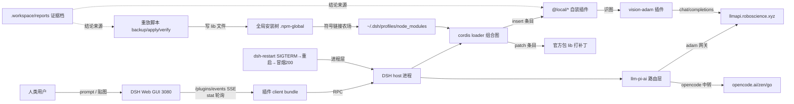
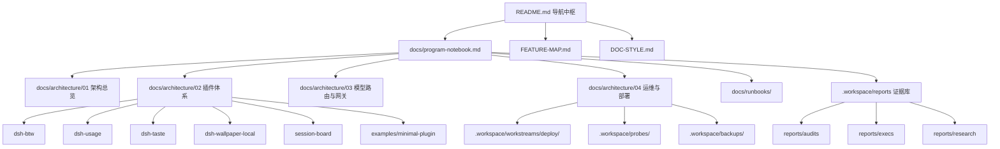
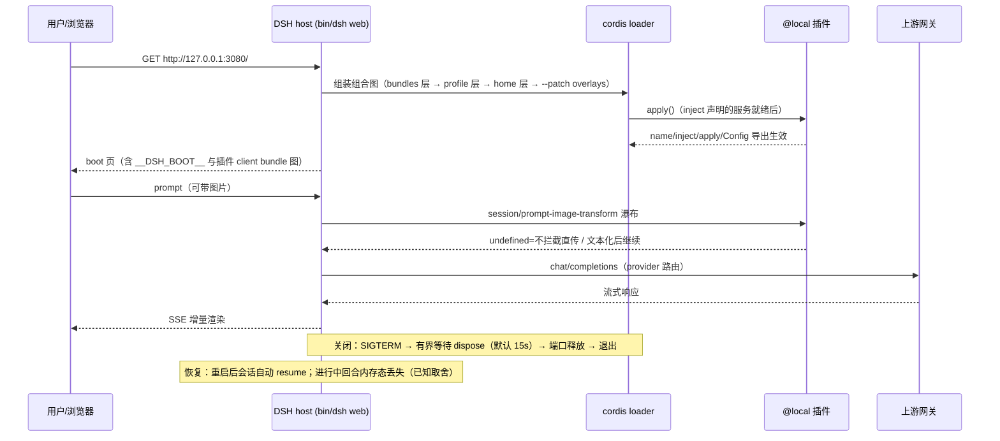

# dsh-hub 程序笔记本（Program Notebook）

> **Tier 0 · 中枢** · [指南地图](../README.md) · [风格约定](../DOC-STYLE.md) · [功能地图](../FEATURE-MAP.md)

本页是 dsh-hub 的**中枢索引与摘要**，回答「这个仓库是什么、东西在哪、现在什么状态、哪里已知有病」。
它不是正文仓库：每个专题的完整内容在 `docs/architecture/`，证据在 `.workspace/reports/` 与
`.workspace/` 下的部署批次目录里。

> **数据时点**：2026-09-20。所有架构事实均取自**当前源码/配置/git**，逐条给出 `path:line` 证据；
> 无法验证的一律标 **未知**，不猜测补全（依据：`program-notebook` skill 的
> `references/maintenance-playbook.md`「不推测」条）。

---

## 0. 一句话定位与归属表

| 职责 | 归属 |
| --- | --- |
| 人类入口、导航中枢、三条规则 | 根 `README.md`（Tier 0） |
| 文档写作约定（状态词汇 / 诚实边界 / 导航表 / 代码块规范） | 根 `DOC-STYLE.md`（Tier 0） |
| 每项能力的**状态与起点**（带日期） | 根 `FEATURE-MAP.md`（Tier 2） |
| **结构/数据流/运行流/配置链/缺陷摘要 + 全库索引** | **本页 `docs/program-notebook.md`（Tier 0 中枢）** |
| 展开型专题（程序结构 / 插件体系 / 模型路由 / 运维部署） | `docs/architecture/01..04` |
| 操作手册（按场景照做） | `docs/runbooks/` |
| 审计 / 执行 / 复核 / 调研 / 事故 / 验收**证据**与其机器可读产物 | `.workspace/reports/`（Tier 3） |
| 部署包、补丁批次、重放脚本 | `.workspace/workstreams/deploy/` |
| 探针脚本、一次性捕获、预览图 | `.workspace/probes/` |
| 备份（已 gitignore） | `.workspace/backups/` |

判据（可复判）：移除本页后，读者仍能从 `README.md` 知道「去哪找」；但**无法**知道
「模块怎么连、启动怎么走、配置从哪读、有什么已知缺陷」——后者是本页的独有职责。

---

## 1. 全局数据流摘要

只描述本仓库自身的核心调用链，不追踪官方库内部实现。

（实现关系用 `-.->` 与调用/数据流区分。数据流的完整展开见
`docs/architecture/01-architecture-overview.md`；图像链路的 fail-closed 细节见
`docs/architecture/03-model-routing-gateway.md` §图像能力检测。）

---

## 2. 架构摘要

每个节点都参与至少一条连线，无孤立节点。

**关键设计边界（不展开结构体字段）**

- 本仓库是**插件源码 + 补丁批次 + 证据**三合一；DSH 本体不在此仓库（全局安装于
  `~/.npm-global`）。
- 插件**源码仓库 ≠ 运行时装单位**：仓库在 `/home/CNS2026495165/dsh`，运行时在
  `~/.dsh/profiles/node_modules/@local/`（真实目录拷贝，非符号链接）。
- 目录名 ≠ 包名：`dsh-wallpaper-local/` 的包是 `@local/dsh-wallpaper`；
  `session-board/` 的真正包在子目录 `session-board/dsh-session-board/`。
- `dsh-taste/` 是**自写源码**，但占用官方命名空间 `@deepseek-ai/dsh-taste`，且不带
  `dsh.bundle.patch`——不要按「官方包」描述它。
- `pi-taste-analysis/` **不是插件**（无 `package.json`），是调研分析档 + vendored 上游 TS 源码。
  证据见 `docs/architecture/01-architecture-overview.md` §模块清单。

---

## 3. 程序运行流摘要

启动 / 运行 / 关闭 / 错误路径的完整版（含 restart 守卫与 fail-closed 分支）见
`docs/architecture/04-ops-deploy.md` §运行流。

---

## 4. 配置加载链

**从哪加载 → 谁消费**，三层各自独立：

| 层 | 来源 | 内容 | 谁消费 | 生效方式 |
| --- | --- | --- | --- | --- |
| 运行时设置 | `~/.dsh/settings.yaml`（唯一一份；路径规则 = 显式 `path` 优先，否则 `<harness home>/settings.yaml`） | `llm-pi-ai` providers/models、`vision-adam`、`dsh-subagent`、`agent-default-model`、`agent-presets`、`wallpaper`、`dsh-ssh-gui`、`ui-theme` | 各插件宿主侧 + 路由层 | **值级热载**（下一次读取即新值），schema/代码类改动需随插件部署重启一次 |
| 插件组合 | `~/.dsh/profiles/web/cordis.patch.yml`（**运行入口**）叠加 `dsh.profile.bundles` 各 bundle 的 `dsh.bundle.patch` | loader patch 条目：`insert` / id 级 `config` 覆盖 / `disabled` / `!!js` 表达式 | cordis loader | **条目级热载**（约 1s）；`insert` 的 `name` 必须是 **bare 包名**，用文件路径名会 import 失败并整次回滚 |
| 凭据 | `~/.dsh/.credentials.yaml` | `apiKeyEnv` 引用的**值**（`ADAM_API_KEY` / `OPENCODE_GO_API_KEY` / `DEEPSEEK_API_KEY`） | provider 层、vision-adam | settings.yaml **只存引用名**，永不入库；解析顺序 = credentials 服务 → 启动环境变量 → 字面量 `apiKey` |

组合顺序（逐层覆盖）：**bundles 层 → profile 自身层 → home 层 `$DSH_HOME/cordis.patch.yml` →
`--patch` overlays**。

> ⚠️ **已知陷阱（本文档必须写对）**：`dsh-subagent` settings 层是**字段级**覆盖，不是整对象替换。
> 本部署 settings.yaml 只设了 `model`、**没有设 `provider`** ⇒ preset 的 `provider: adam` 被保留，
> 生效路由应为 `adam/deepseek-v4-pro`。`~/.dsh/AGENTS.md` 与 preset 注释里「子代理固定
> `adam/deepseek-v4.1-flash`」的说法**已被 settings 段覆盖**，不得照抄。证据与行号见
> `docs/architecture/03-model-routing-gateway.md` §子代理路由合并层。

---

## 5. 模块摘要

### 5.1 自装插件（本仓库持有源码）

| 目录 | 包名 | 形态 | 一句话职责 |
| --- | --- | --- | --- |
| `dsh-btw/` | `@local/dsh-btw` | host + client | 侧边对话：贴图经 vision-adam 转文本、子代理树/项目总览跳转、面板对齐；默认/清单每次调用热读 |
| `dsh-usage/` | `@local/dsh-usage` | host + client | API 用量统计：面积/柱状/热力图（自绘 SVG）+ 自绘 tooltip |
| `dsh-taste/` | `@deepseek-ai/dsh-taste` | host + client | 偏好记忆；**无 `dsh.bundle.patch`** |
| `dsh-wallpaper-local/` | `@local/dsh-wallpaper` | host + client | 静态壁纸 fork；`dsh.client.immediately = true` |
| `session-board/dsh-session-board/` | `@deepseek-ai/dsh-session-board` | **host-only** | 会话状态看板；无 `lib/client.js`、无 `cordis.patch.yml` |
| `examples/minimal-plugin/` | `@local/dsh-minimal-plugin` | host (+可选 client) | 最小插件脚手架：拷贝 + `insert` 即启动 |

### 5.2 非插件目录

| 目录 | 性质 |
| --- | --- |
| `pi-taste-analysis/` | 调研分析档 + `vendor/pi-taste/`（上游 Pi agent TS 源码，不可挂载） |
| `.workspace/reports/` | 审计/执行/复核/调研/事故/验收证据（Tier 3） |
| `.workspace/workstreams/deploy/` | 部署包 + 补丁批次 + 重放脚本（含 `patches/*.patch` 可执行规范） |
| `.workspace/probes/` | 探针脚本、一次性请求/响应捕获、settings 快照、预览图 |
| `.workspace/backups/` | 备份（`.gitignore` 已排除，只作本机回滚用） |
| `.workspace/workstreams/{sources,baseline-011,plugin-restore,side-deploy,…}` | 移植源副本、基线 tgz、恢复/支线部署批次 |

大型目录不逐文件罗列：模块级细节与调用链见 `docs/architecture/01..04`。

---

## 6. 参考资料索引

索引只给路径与一句话职责，不复制正文。

| 文件 / 目录 | 回答什么 |
| --- | --- |
| `README.md` | 这是什么仓库、从哪里开始、三条规则 |
| `DOC-STYLE.md` | 文档怎么写（状态词汇、诚实边界、导航表、代码块规范） |
| `FEATURE-MAP.md` | 每项能力的状态（带日期）与入口 |
| `docs/architecture/01-architecture-overview.md` | 完整程序结构、模块职责、关键依赖、数据流展开 |
| `docs/architecture/02-plugin-system.md` | 插件契约、组合图装载、hot/cold 边界、settings 槽 |
| `docs/architecture/03-model-routing-gateway.md` | provider/model 配置链、子代理路由合并层、网关、图像能力检测 |
| `docs/architecture/04-ops-deploy.md` | 补丁重放 fail-closed 契约、重启、验收矩阵、测试架构、备份布局 |
| `docs/runbooks/switch-web2-runbook.md` | 切换到 web2 独立实例的验收流程 |
| `docs/runbooks/verify-runbook.md` | 合并手工验收清单（btw 8 步 + 壁纸 12 步） |
| `.workspace/reports/runbooks/` | 主题 Runbook：总 Runbook、lag-fix、btw v2、combined-restore |
| `.workspace/reports/execs/` `.workspace/reports/audits/` | 每项能力的执行与审计证据 |
| `.workspace/reports/plans/` | 需求对齐与接线计划（`../.workspace/reports/plans/btw-wallpaper-plan.md`、`../.workspace/reports/plans/wiring-plan.md`） |
| `.workspace/reports/reference/local-api-surface.md` | 本地部署 API 面 vs master 源码差异 |
| `.workspace/workstreams/deploy/*/patches/*.patch` | 官方包补丁的 unified diff（**可执行规范**） |
| `.workspace/workstreams/deploy/deploy-lag/README.md` §9 | 运行时热载能力矩阵（P0-a 实测固化） |
| `examples/minimal-plugin/README.md` | 写第一个插件 |
| `.dsh/skills/program-notebook/` | 本页的编写规范（skill 自述 + `references/`） |

---

## 7. 已验证的实现缺陷与限制

每条都给出当前代码/配置/git 证据；无法验证的标 **未知**。

| # | 缺陷 / 限制 | 状态 | 证据 |
| --- | --- | --- | --- |
| D1 | **子代理路由文档漂移**：`~/.dsh/AGENTS.md` 与 preset 注释称「两阶段统一 `adam/deepseek-v4.1-flash`」，但 settings.yaml 只设 `model: deepseek-v4-pro` 而未设 `provider`，按字段级合并 ⇒ 实际生效路由为 `adam/deepseek-v4-pro` | **未修复**（本页如实记，不代改他人文档） | `~/.dsh/settings.yaml:217-218`；`dsh-tool-subagent/lib/index.js:132-134`；`~/.dsh/.agent-presets/standard-glm/agent.cordis.yml:193-195` |
| D2 | **`workflow` 无默认模型常量**：preset 里 `workflow-worker-thread` 只声明 `provider: spawn`，模型继承父代理——「workflow 默认模型」在本仓库**不存在**，历史文档若写具体模型即为臆造 | 已澄清（本页定性） | `~/.dsh/.agent-presets/standard-glm/agent.cordis.yml:230-233` |
| D3 | **`deploy-slots/backup-*` 与 `.workspace/workstreams/deploy/deploy-015/` 未被 gitignore**，与 `.workspace/backups/*` 的排除规则不一致（备份内容会进 HEAD 跟踪） | **未修复**（本阶段禁改 `.gitignore`，已上报） | `.gitignore:22-23`（只覆盖 `.workspace/backup-*/` 与 `.workspace/workstreams/deploy/deploy-lag/backup-*/`）；`git ls-files .workspace/workstreams/deploy/deploy-slots/backup-*` = 2 |
| D4 | **btw 备份 ≠ live 态**：现有备份不含后续单元，`--rollback` 会连带退掉后续改动；验收记录已标黄灯 | 已知限制 | `.workspace/reports/execs/acceptance/acceptance-exec.md` §3.1 |
| D5 | **R1 红灯未落地**：回滚 glob `…index.js.bak-*.bak` 展开 0 文件的问题号称「纳入文档回写」，但仓库此前无 `docs/`，修复尚未落地 | **未修复** | `acceptance-exec.md` §3.1；本页所在目录即该回写的落点 |
| D6 | **真机面未实测**：`ws_serial_*` / `ws_flash` 只过本地单测与静态加载；分布式控制（SSH / 真串口 / serial-tcp）未真机 | 已实现·**未真机** | `FEATURE-MAP.md` §一；`.workspace/reports/execs/workerspace/workerspace-exec.md` |
| D7 | **B 通道热载未投产**：纯函数模块热载机制实验通过，但投产需改官方 `cordis-plugin-hmr` + 一次重启落地（鸡生蛋） | **尚不可用** | `FEATURE-MAP.md` §三；`.workspace/reports/execs/p0-hotload/p1-hotswap-gate-exec.md` |
| D8 | **`replay-lag-fix.sh` 头部注释「本环境 pnpm 不可用」已过期**（pnpm 二进制存在，只是无工程可 build） | 文档漂移，**未修复** | `.workspace/workstreams/deploy/deploy-lag/replay-lag-fix.sh:28` vs `acceptance-probe` 侧审计结论 |
| D9 | **`session-board` 包的实际部署位置未确证**：`@deepseek-ai/dsh-session-board` 未出现在 `~/.dsh/profiles/node_modules/@local/` 列表中 | **未知** | `ls ~/.dsh/profiles/node_modules/@local/`（本轮取证未见该包） |
| D10 | **`install — models 段不完整的历史教训已修复但机制仍脆弱**：adam 曾 45/50 条目缺 `contextWindow` → 回落 262144 触发误判超窗；现按保守档补齐，但**新增模型若漏写 `contextWindow` 会再次踩坑** | 已修复（机制性风险仍在） | `acceptance-exec.md` §3.6；`dsh-llm-pi-ai/lib/index.js:849`（`DEFAULT_CONTEXT_WINDOW = 262144`） |
| D11 | **btw vitest 存在负载敏感 flake**（已加固为首跑 1 failed / 隔离 10/10、全量复跑 3/3 全绿）——不得写成"测试全绿"或"存在回归" | 已加固 | `acceptance-exec.md` §3.2；`dsh-btw/tests/host-opening.spec.ts:145` |
| D12 | **设置页全链路卡顿尚未证实消除**：P1/P2/C2 只覆盖局部 runtime/插件成本；session churn→projection/list.set→下游渲染与 usage 同步 SQLite/ingest 仍是两个独立候选。**已修** usage 旧响应覆盖（client，热面，真实浏览器 before/after 已验证）与宿主 bootstrap 生命周期（host，冷面，待重启生效）。**被推翻**：`SettingsRoot` selector 早已返回 boolean（`useSyncExternalStoreWithSelector` 比较选择结果）、`SessionMaybeProvider` 订阅稳定 provideInfo ⇒「无 memo 即每事件重渲染」不成立；C2 生产已有 pendingScan 合并 + 300ms 间隔。**口径更正**：ingest 478–846ms 是独立进程 parser 基准，不是宿主 tick 实测 | **部分修复**（R4 已落地；memo/C2 待根因重定） | `.workspace/lag-fix/reports/settings-jank-revise-exec.md`；`settings-jank-audit-synthesis.md`；`settings-jank-revise-audit.md`；`.workspace/lag-fix/ingest-gate/audit.md` |

---

## 8. 未验证项（本页明确不声称）

1. `dsh-subagent` 缺 `provider` 时的**运行时**实际路由未做活体探针（D1 是「代码行为 + settings 值」的推论，非实测）。
2. `opencode-go` provider 的内置 catalog 实际 `baseURL`/`api` 取值未打开确认（settings 里只有 `apiKeyEnv`）。
3. 浏览器收到 client bundle `rebuilt` SSE 帧后是否自动重载（vs 手动刷新）未读客户端代码确认。
4. `session-board` 的运行时装单位（见 D9）。
5. cordis 内核 `Entry.update` / `_patchContext` 的逐行实现未读，热载机制描述以实测与官方包注释为准。

以上均标注为**未知**，不写入架构断言。

---

## 9. 维护触发条件（何时必须回来更新本页）

- 模块新增/删除/移动、入口点或公共 API 变化 → 更新 §5 与 `docs/architecture/01`。
- 数据流、状态机、协议、异步任务所有权变化 → 更新 §1/§3 与 `docs/architecture/01`。
- 配置 schema、默认值、覆盖顺序变化 → 更新 §4 与 `docs/architecture/03`。
- 构建/部署/CI/测试架构与质量门变化 → 更新 §6 与 `docs/architecture/04`。
- 缺陷被修复或被推翻 → 更新 §7（删除已失效条目，或在状态列标注「已修复」并附当前证据）。
- 纯格式化、拼写、无行为影响的局部重命名 → 无需更新（但要在提交说明里给出判据）。
